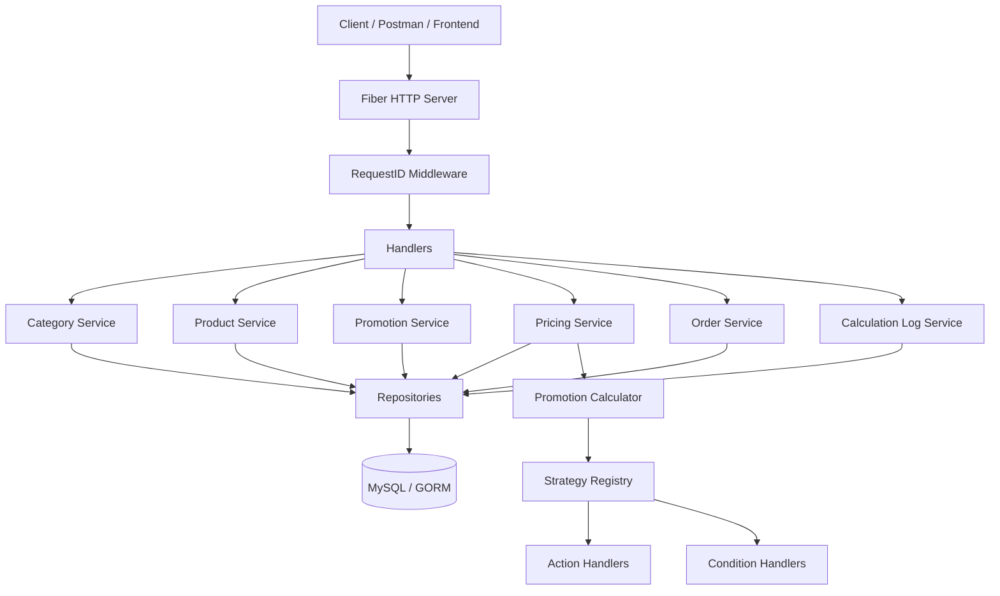
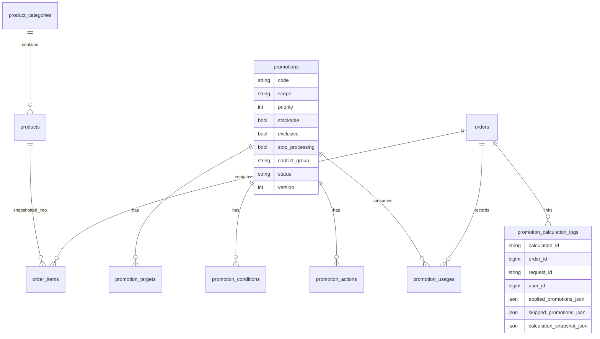
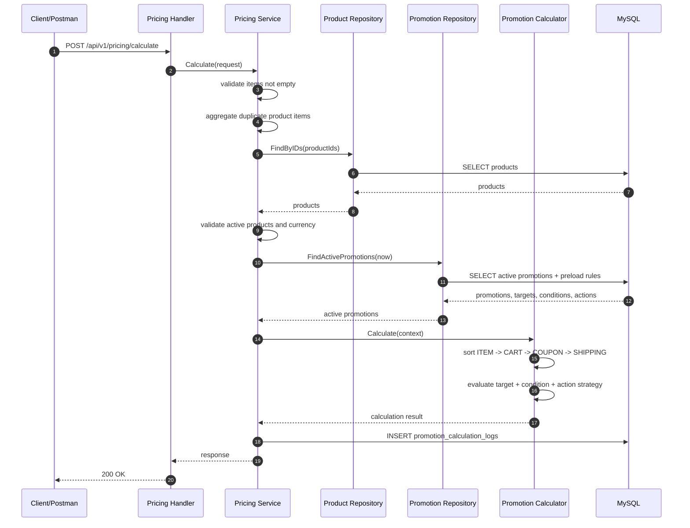
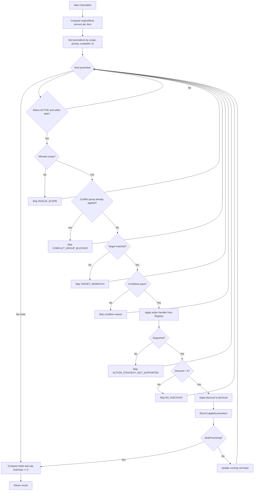
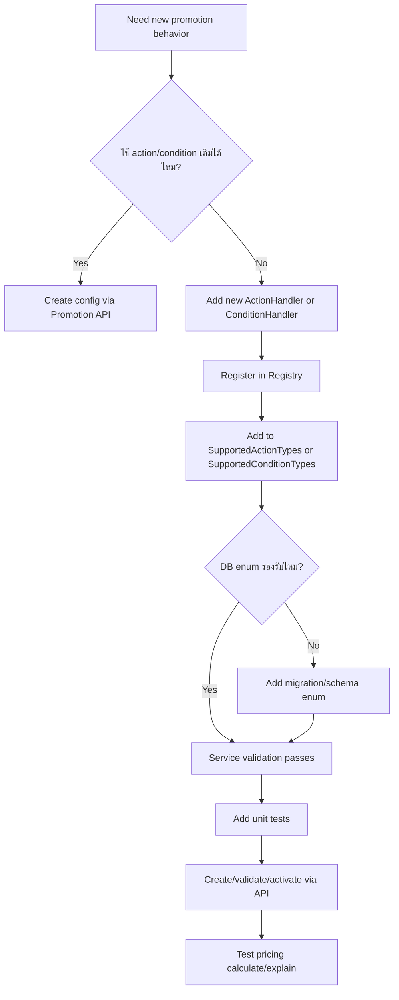
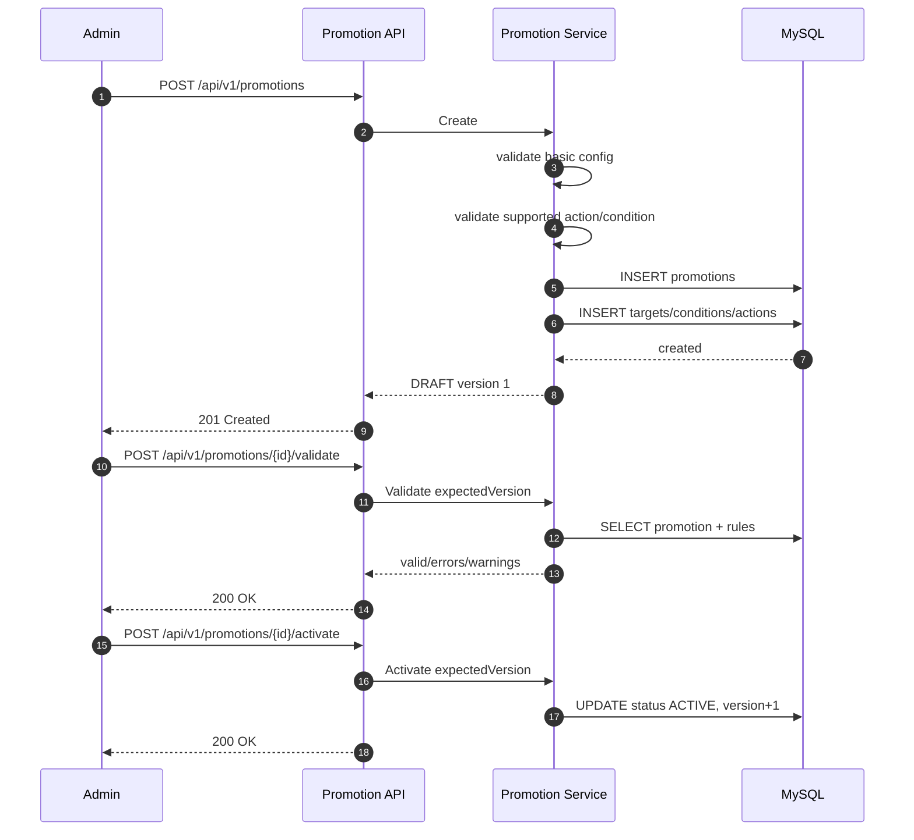
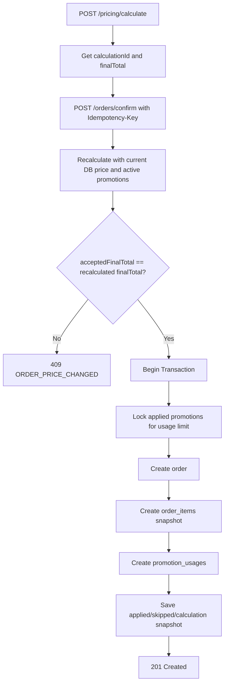

# Promotion Engine System Design Proof

เอกสารนี้อธิบายว่าโค้ดในโปรเจกต์นี้ตอบโจทย์ “ระบบคำนวณราคาสุทธิของคำสั่งซื้อที่รองรับโปรโมชั่นหลายแบบและโปรโมชั่นซ้อนกัน” ได้อย่างไร โดยอ้างอิงจากโค้ดจริงใน repository เท่านั้น

> ขอบเขตเอกสารนี้: อธิบาย design, data model, calculation flow, extension flow, system flow, testing strategy, Postman scenario และข้อจำกัดที่ยังควรรู้ก่อนนำไปพัฒนาต่อ

---

## 1. สรุปคำตอบแบบตรงโจทย์

### 1.1 ถ้าระบบรองรับ promotion แบบซ้อนกัน ต้องจัดลำดับคำนวณยังไง

ระบบนี้กำหนดลำดับคำนวณเป็น deterministic order ดังนี้

1. `ITEM`
2. `CART`
3. `COUPON`
4. `SHIPPING`

ถ้า promotion อยู่ scope เดียวกัน จะเรียงต่อด้วย

1. `priority ASC`
2. `created_at ASC`
3. `id ASC`

อ้างอิงโค้ด:

- `internal/promotion/engine.go:16` นิยาม scope order
- `internal/promotion/engine.go:101` sort promotions ด้วย scope rank, priority, createdAt, id
- `internal/repository/promotion_repository.go:66` query active promotion พร้อม preload rules
- `internal/repository/promotion_repository.go:75` order query จาก DB ด้วย `scope ASC, priority ASC, created_at ASC, id ASC`
- `database/schema.sql:287` index สำหรับ active promotion sorting

แนวคิดสำคัญ:

- ลดระดับสินค้า (`ITEM`) ก่อน เพราะเป็นส่วนลดที่ผูกกับ item line
- ลดระดับตะกร้า (`CART`) หลังจาก item discount เพื่อใช้ยอดตะกร้าที่อัปเดตแล้ว
- คูปอง (`COUPON`) ตรวจเงื่อนไขจาก coupon code หลังรู้ subtotal ที่ผ่าน item/cart แล้ว
- shipping (`SHIPPING`) อยู่ท้ายสุด เพราะควรคำนวณหลังรู้ order eligibility โดยรวม

### 1.2 ถ้าต้องการเพิ่ม promotion จะทำยังไงเพื่อไม่ให้กระทบ logic เดิม

ถ้า promotion ใหม่ใช้ action/condition ที่ระบบรองรับอยู่แล้ว ให้เพิ่มผ่าน API/DB โดยไม่ต้องแก้ calculation engine

ตัวอย่างที่เพิ่มได้โดยไม่แก้ engine:

- สินค้า 1 ลด 10% ใช้ `PERCENTAGE_DISCOUNT`
- สินค้า 2 ลด 100 บาท ใช้ `FIXED_AMOUNT_DISCOUNT`
- ทั้งตะกร้าลด 5% ใช้ `CART_PERCENTAGE_DISCOUNT`
- ทั้งตะกร้าลด 50 บาท ใช้ `CART_FIXED_AMOUNT_DISCOUNT`
- ใช้ coupon code แล้วลดทั้งตะกร้า ใช้ condition `COUPON_CODE` + action `CART_FIXED_AMOUNT_DISCOUNT`
- ใช้ payment method แล้วลด ใช้ condition `PAYMENT_METHOD`
- ยอดซื้อขั้นต่ำแล้วลด ใช้ condition `MIN_ORDER_AMOUNT`

อ้างอิงโค้ด:

- `internal/service/promotion_service.go:52` create promotion แล้ว persist rules ใน transaction
- `internal/service/promotion_service.go:350` validate promotion config ว่ามี targets/actions และ action/condition รองรับ
- `internal/service/promotion_service.go:408` persist targets, conditions, actions แยก table
- `internal/promotion/registry.go:57` list action types ที่รองรับ
- `internal/promotion/registry.go:67` list condition types ที่รองรับ

### 1.3 ถ้าต้องการเพิ่ม promotion ใหม่ที่ไม่เคยมีมาก่อน จะ design ยังไงให้รองรับ

ระบบใช้แนวคิด `Strategy Pattern + Registry Pattern`

ถ้า action ใหม่ไม่ใช่รูปแบบเดิม เช่น `LOYALTY_BONUS`, `BUY_X_GET_Y`, `BUNDLE_DISCOUNT`, `CARD_BIN_DISCOUNT` ให้เพิ่ม strategy handler ใหม่ แล้ว register เข้า registry โดยไม่ต้องแก้ main calculation loop

อ้างอิงโค้ด:

- `internal/promotion/registry.go:20` นิยาม `ActionHandler`
- `internal/promotion/registry.go:22` นิยาม `ConditionHandler`
- `internal/promotion/registry.go:39` register action handler
- `internal/promotion/registry.go:43` register condition handler
- `internal/promotion/engine.go:199` engine apply action ผ่าน registry
- `internal/promotion/engine.go:228` engine evaluate condition ผ่าน registry
- `test/unit/promotion/engine_test.go:97` unit test พิสูจน์ว่า custom action ใหม่ register เพิ่มได้โดยไม่แก้ engine loop

ข้อควรรู้:

- `database/schema.sql:180` มี enum action type รวม `BUY_X_GET_Y` และ `BUNDLE_DISCOUNT` ไว้ใน DB แล้ว
- แต่ `internal/promotion/registry.go:57` ยังไม่ได้ประกาศ `BUY_X_GET_Y` และ `BUNDLE_DISCOUNT` เป็น supported action ใน service validation
- ถ้าจะเปิดใช้จริง ต้องเพิ่ม handler, register, supported list, validation test และ migration/enum ให้ตรงกัน

---

## 2. Requirement-to-Code Mapping

| โจทย์/Requirement | คำตอบในระบบนี้ | Code Reference | Test/Proof |
|---|---|---|---|
| รองรับ promotion หลายแบบ | แยก promotion เป็น metadata + targets + conditions + actions | `internal/model/models.go:69`, `internal/model/models.go:91`, `internal/model/models.go:101`, `internal/model/models.go:113` | `test/unit/promotion/engine_test.go:12` |
| ลดราคาต่อชิ้น 10% | ใช้ `PERCENTAGE_DISCOUNT` กับ scope `ITEM` และ target product | `internal/promotion/engine.go:253`, `database/seed.sql:23`, `database/seed.sql:49` | ยิง `POST /api/v1/pricing/calculate` ด้วย product 1 |
| ลดราคาต่อชิ้น 100 บาท | ใช้ `FIXED_AMOUNT_DISCOUNT` กับ scope `ITEM` และ target product | `internal/promotion/engine.go:271`, `database/seed.sql:24`, `database/seed.sql:50` | ยิง `POST /api/v1/pricing/calculate` ด้วย product 2 |
| Promotion ซ้อนกัน | sort ตาม scope -> priority -> createdAt -> id แล้ว apply ต่อเนื่อง | `internal/promotion/engine.go:101` | `test/unit/promotion/engine_test.go:12` |
| Conflict ระหว่าง promo | ใช้ `conflict_group` กัน promo กลุ่มเดียวกันซ้ำ | `internal/promotion/engine.go:146`, `internal/promotion/engine.go:177` | seed promo 1 และ 2 อยู่ `PRODUCT_DISCOUNT` เหมือนกัน |
| เพิ่ม promotion โดยไม่แก้ logic | insert config ผ่าน promotion API ลง rules tables | `internal/service/promotion_service.go:52`, `internal/service/promotion_service.go:408` | Postman create/validate/activate/calculate |
| เพิ่ม promotion type ใหม่ | เพิ่ม strategy handler แล้ว register ผ่าน registry | `internal/promotion/registry.go:39`, `internal/promotion/engine.go:199` | `test/unit/promotion/engine_test.go:97` |
| ใช้ราคาจาก server ไม่ trust client | PricingService load products จาก DB แล้วใช้ `PriceAmount` | `internal/service/pricing_service.go:70`, `internal/service/pricing_service.go:103` | ส่ง request ไม่มีราคา แต่ response มีราคาจาก DB |
| Order confirm ต้อง recalculate | Confirm เรียก pricing.Calculate ซ้ำก่อนสร้าง order | `internal/service/order_service.go:78`, `internal/service/order_service.go:87` | `test/unit/handler/order_handler_test.go:91` |
| Audit/replay | บันทึก calculation snapshot และ replay จาก request เดิม | `internal/service/pricing_service.go:184`, `internal/service/calculation_log_service.go:104` | `test/unit/service/calculation_log_service_test.go:45` |

---

## 3. System Architecture ตามโค้ดปัจจุบัน

โครงสร้าง runtime ของระบบนี้เป็น layered architecture:



อ้างอิงโค้ด:

- `cmd/server/main.go:21` load config
- `cmd/server/main.go:22` connect MySQL ผ่าน GORM
- `cmd/server/main.go:34` build repositories
- `cmd/server/main.go:41` build services
- `cmd/server/main.go:49` build handlers
- `cmd/server/main.go:58` mount `/api/v1`
- `cmd/server/main.go:77` promotion routes
- `cmd/server/main.go:89` pricing routes
- `cmd/server/main.go:94` order routes
- `cmd/server/main.go:100` audit routes

---

## 4. Promotion Data Model Design

### 4.1 ภาพรวมตาราง



### 4.2 ทำไม table design นี้ยืดหยุ่น

แทนที่จะ hard-code promotion เป็น column เช่น `discount_percent`, `discount_amount`, `coupon_code` ไว้ในตารางเดียว ระบบนี้แยก rules ออกเป็น 3 กลุ่ม:

1. `promotion_targets` ระบุว่า promotion นี้ยิงไปที่อะไร
2. `promotion_conditions` ระบุว่า promotion นี้ใช้ได้เมื่อไร
3. `promotion_actions` ระบุว่า promotion นี้ลดอะไร/ลดเท่าไร

ผลลัพธ์:

- promotion หนึ่งตัวมีหลาย target ได้
- promotion หนึ่งตัวมีหลาย condition ได้
- promotion หนึ่งตัวมีหลาย action ได้
- เพิ่ม promotion config ใหม่ได้ผ่าน data โดยไม่ต้องเพิ่ม column ใหม่ทุกครั้ง
- `value_json` รองรับ config ที่มี shape ต่างกันในอนาคต

อ้างอิง schema:

- `database/schema.sql:105` ตาราง `promotions`
- `database/schema.sql:134` ตาราง `promotion_targets`
- `database/schema.sql:149` ตาราง `promotion_conditions`
- `database/schema.sql:177` ตาราง `promotion_actions`
- `database/schema.sql:207` ตาราง `promotion_usages`
- `database/schema.sql:229` ตาราง `promotion_calculation_logs`

อ้างอิง GORM model:

- `internal/model/models.go:69` `Promotion`
- `internal/model/models.go:91` `PromotionTarget`
- `internal/model/models.go:101` `PromotionCondition`
- `internal/model/models.go:113` `PromotionAction`
- `internal/model/models.go:126` `PromotionUsage`
- `internal/model/models.go:137` `PromotionCalculationLog`

### 4.3 ตาราง promotions

ตารางนี้เป็น metadata ของ promotion:

- `code`: unique code สำหรับ campaign/coupon
- `scope`: ระดับที่ใช้คำนวณ เช่น `ITEM`, `CART`, `COUPON`, `SHIPPING`
- `priority`: ลำดับใน scope เดียวกัน
- `stackable`: flag สำหรับบอกว่า promotion นี้ออกแบบให้ซ้อนกับตัวอื่นได้หรือไม่
- `exclusive`: flag สำหรับ business policy ในอนาคต
- `stop_processing`: ถ้า apply แล้วหยุด evaluate promotion ตัวถัดไป
- `conflict_group`: กัน promotion กลุ่มเดียวกัน apply ซ้ำ
- `status`: `DRAFT`, `ACTIVE`, `INACTIVE`, `EXPIRED`
- `starts_at`, `ends_at`: active window
- `max_usage`, `max_usage_per_user`: usage limit
- `version`: optimistic version สำหรับ replace/patch/activate/deactivate

อ้างอิง:

- `internal/model/models.go:71` ถึง `internal/model/models.go:88`
- `database/schema.sql:105` ถึง `database/schema.sql:132`

### 4.4 ตาราง promotion_targets

ใช้บอกว่า promotion นี้ apply กับ target ใด:

- `PRODUCT`: สินค้าเฉพาะตัว
- `CATEGORY`: หมวดหมู่สินค้า
- `CART`: ทั้งตะกร้า
- `USER_SEGMENT`: segment ผู้ใช้
- `BRAND`: brand

อ้างอิง:

- `internal/model/models.go:91`
- `database/schema.sql:134`

ตัวอย่าง:

```json
{
  "targetType": "PRODUCT",
  "targetId": 1
}
```

หมายถึง promotion นี้ใช้กับสินค้า `productId=1`

### 4.5 ตาราง promotion_conditions

ใช้บอกเงื่อนไขที่ต้องผ่านก่อน apply action:

- `PRODUCT_ID`
- `CATEGORY_ID`
- `MIN_ORDER_AMOUNT`
- `MAX_ORDER_AMOUNT`
- `COUPON_CODE`
- `USER_SEGMENT`
- `FIRST_ORDER`
- `PAYMENT_METHOD`
- `DATE_RANGE`

อ้างอิง:

- `internal/model/models.go:101`
- `database/schema.sql:149`
- `internal/promotion/registry.go:67`
- `internal/promotion/registry.go:89`

ตัวอย่าง coupon:

```json
{
  "conditionType": "COUPON_CODE",
  "operator": "EQ",
  "valueJson": "SAVE50",
  "logicalOperator": "AND"
}
```

ตัวอย่าง payment method:

```json
{
  "conditionType": "PAYMENT_METHOD",
  "operator": "EQ",
  "valueJson": "CREDIT_CARD",
  "logicalOperator": "AND"
}
```

### 4.6 ตาราง promotion_actions

ใช้บอกว่าจะลดอย่างไร:

- `PERCENTAGE_DISCOUNT`
- `FIXED_AMOUNT_DISCOUNT`
- `CART_PERCENTAGE_DISCOUNT`
- `CART_FIXED_AMOUNT_DISCOUNT`
- `FREE_SHIPPING`
- DB enum มี `BUY_X_GET_Y`, `BUNDLE_DISCOUNT` เตรียมไว้ แต่ engine ยังไม่เปิด supported list

อ้างอิง:

- `internal/model/models.go:113`
- `database/schema.sql:177`
- `internal/promotion/registry.go:57`
- `internal/promotion/registry.go:81`

ตัวอย่างลดสินค้า 10%:

```json
{
  "actionType": "PERCENTAGE_DISCOUNT",
  "valueBasisPoints": 1000,
  "appliesTo": "ITEM"
}
```

ตัวอย่างลดสินค้า 100 บาท:

```json
{
  "actionType": "FIXED_AMOUNT_DISCOUNT",
  "valueAmount": 10000,
  "appliesTo": "ITEM"
}
```

หมายเหตุเรื่องเงิน:

- ระบบเก็บเงินเป็น minor unit
- ถ้าเป็น THB: `100 บาท = 10000`
- `10% = 1000 basis points`
- `100% = 10000 basis points`

อ้างอิง:

- `database/schema.sql:3`
- `database/schema.sql:4`

---

## 5. Promotion Calculation Flow

### 5.1 Flow ระดับ pricing calculate



อ้างอิงโค้ด:

- `internal/service/pricing_service.go:60` เริ่ม core calculation flow
- `internal/service/pricing_service.go:61` reject empty items
- `internal/service/pricing_service.go:65` aggregate duplicated items
- `internal/service/pricing_service.go:70` batch load products
- `internal/service/pricing_service.go:78` reject inactive products
- `internal/service/pricing_service.go:86` validate currency
- `internal/service/pricing_service.go:113` load active promotions
- `internal/service/pricing_service.go:118` call calculator
- `internal/service/pricing_service.go:175` persist calculation log
- `internal/service/pricing_service.go:210` aggregate item implementation

### 5.2 Flow ระดับ promotion engine



อ้างอิงโค้ด:

- `internal/promotion/engine.go:126` compute original/final amount
- `internal/promotion/engine.go:138` loop active promotions
- `internal/promotion/engine.go:139` check active window
- `internal/promotion/engine.go:142` check allowed scope
- `internal/promotion/engine.go:146` check conflict group
- `internal/promotion/engine.go:150` evaluate target
- `internal/promotion/engine.go:154` evaluate conditions
- `internal/promotion/engine.go:159` apply promotion
- `internal/promotion/engine.go:164` skip no-discount
- `internal/promotion/engine.go:169` append applied promotion
- `internal/promotion/engine.go:181` stop processing
- `internal/promotion/engine.go:186` recompute cart base
- `internal/promotion/engine.go:189` compute totals
- `internal/promotion/engine.go:192` cap final total at zero

---

## 6. Design Patterns ที่ใช้

### 6.1 Strategy Pattern

ปัญหาที่แก้:

- promotion แต่ละแบบมีวิธีคำนวณต่างกัน
- ถ้าเขียน `if actionType == ...` เต็ม engine จะเพิ่ม promotion ใหม่ยาก
- logic เดิมเสี่ยงพังเมื่อเพิ่ม case ใหม่

วิธีที่ระบบนี้ใช้:

- action แต่ละแบบเป็น function strategy
- condition แต่ละแบบเป็น function strategy
- engine ไม่รู้รายละเอียดของแต่ละ promotion type
- engine เรียกผ่าน registry ด้วย `actionType` และ `conditionType`

อ้างอิง:

- `internal/promotion/registry.go:20` `ActionHandler`
- `internal/promotion/registry.go:22` `ConditionHandler`
- `internal/promotion/engine.go:203` หา action handler จาก registry
- `internal/promotion/engine.go:233` หา condition handler จาก registry

### 6.2 Registry Pattern

ปัญหาที่แก้:

- ต้องเพิ่ม promotion type ใหม่โดยลดผลกระทบกับ engine
- อยากให้ engine เป็น generic rule executor

วิธีที่ระบบนี้ใช้:

- `Registry` เก็บ map ของ action handlers และ condition handlers
- default registry register action/condition ที่ระบบรองรับ
- test สามารถ inject registry ใหม่ได้

อ้างอิง:

- `internal/promotion/registry.go:24` registry structure
- `internal/promotion/registry.go:29` create registry
- `internal/promotion/registry.go:39` register action
- `internal/promotion/registry.go:43` register condition
- `internal/promotion/engine.go:87` inject custom registry
- `test/unit/promotion/engine_test.go:97` custom action proof

### 6.3 Rule Engine Pattern

ระบบมอง promotion เป็น rule:

```text
IF target matches
AND conditions pass
THEN execute actions
```

ส่วนประกอบ:

- `PromotionTarget` = rule target
- `PromotionCondition` = rule condition
- `PromotionAction` = rule action

อ้างอิง:

- `internal/model/models.go:86` promotion has targets
- `internal/model/models.go:87` promotion has conditions
- `internal/model/models.go:88` promotion has actions
- `internal/promotion/engine.go:150` evaluate targets
- `internal/promotion/engine.go:154` evaluate conditions
- `internal/promotion/engine.go:159` apply actions

### 6.4 Repository Pattern

ปัญหาที่แก้:

- แยก DB query ออกจาก business logic
- ทำให้ service อ่านง่ายและ test ง่ายขึ้น
- ควบคุม query/index ได้ชัดเจน

อ้างอิง:

- `internal/repository/promotion_repository.go:36` promotion repository interface
- `internal/repository/promotion_repository.go:66` active promotion query
- `internal/repository/calculation_log_repository.go:21` calculation log repository interface
- `internal/service/pricing_service.go:32` pricing service depend on repositories

### 6.5 Snapshot/Audit Pattern

ปัญหาที่แก้:

- ถ้า promotion config เปลี่ยนภายหลัง order เดิมต้องไม่เปลี่ยนผลย้อนหลัง
- ต้อง audit ได้ว่า order คำนวณจาก request/response อะไร
- ต้อง replay ได้เพื่อพิสูจน์ calculation

วิธีที่ระบบนี้ใช้:

- บันทึก applied/skipped promotions เป็น JSON
- บันทึก calculation snapshot เป็น JSON
- order confirm เก็บ snapshot ที่ใช้ตอนสร้าง order
- calculation log replay ใช้ snapshot เดิม

อ้างอิง:

- `internal/model/models.go:48` order applied promotions JSON
- `internal/model/models.go:49` order skipped promotions JSON
- `internal/model/models.go:50` order calculation snapshot JSON
- `internal/model/models.go:146` calculation log applied JSON
- `internal/model/models.go:147` calculation log skipped JSON
- `internal/model/models.go:148` calculation log snapshot JSON
- `internal/service/pricing_service.go:184` persist calculation log
- `internal/service/order_service.go:116` order applied promotions snapshot
- `internal/service/order_service.go:118` order calculation snapshot
- `internal/service/calculation_log_service.go:104` replay flow

### 6.6 Optimistic Locking / Versioning

ปัญหาที่แก้:

- admin หลายคนแก้ promotion พร้อมกัน
- activate/deactivate จาก config version เก่า

วิธีที่ระบบนี้ใช้:

- promotion มี `version`
- replace/patch/activate/deactivate ต้องส่ง `expectedVersion`
- ถ้าไม่ตรงคืน version conflict

อ้างอิง:

- `internal/model/models.go:85` promotion version
- `database/schema.sql:121` promotion version
- `internal/service/promotion_service.go:150` replace checks expected version
- `internal/service/promotion_service.go:204` patch checks expected version
- `internal/service/promotion_service.go:247` validate checks expected version
- `internal/service/promotion_service.go:262` activate checks expected version
- `internal/service/promotion_service.go:284` deactivate checks expected version

### 6.7 Idempotency Pattern

ปัญหาที่แก้:

- customer กดยืนยัน order ซ้ำ
- network timeout แล้ว client retry
- ต้องไม่สร้าง order ซ้ำจาก payload เดิม

วิธีที่ระบบนี้ใช้:

- `orders.idempotency_key` unique
- hash request body
- ถ้า key เดิม payload เดิม คืน order เดิม
- ถ้า key เดิม payload ต่าง reject

อ้างอิง:

- `internal/model/models.go:39` order idempotency key
- `internal/model/models.go:40` request hash
- `database/schema.sql:50` order idempotency key
- `database/schema.sql:67` unique idempotency key
- `internal/service/order_service.go:51` confirm entry
- `internal/service/order_service.go:62` hash order request
- `internal/service/order_service.go:67` find existing idempotency key
- `internal/service/order_service.go:68` reject key reused with different payload

---

## 7. Correctness: ทำไมคำนวณได้ถูกต้อง

### 7.1 Server-side source of truth

Client ส่งแค่ `productId` และ `quantity` ไม่ส่งราคา

PricingService จะ:

1. aggregate item ซ้ำ
2. load product จาก DB
3. ใช้ `Product.PriceAmount`
4. validate product active
5. validate currency

อ้างอิง:

- `internal/service/pricing_service.go:65` aggregate duplicated product IDs
- `internal/service/pricing_service.go:70` load products by IDs
- `internal/service/pricing_service.go:80` reject inactive product
- `internal/service/pricing_service.go:100` reject product currency mismatch
- `internal/service/pricing_service.go:103` map DB product price into calculation item

### 7.2 Deterministic calculation

ผลคำนวณต้องซ้ำได้ถ้า input/config เดิม

ระบบทำให้ deterministic ด้วย:

- sort promotion ด้วย fixed order
- stable sort
- tie-break ด้วย createdAt และ id
- aggregate product IDs แล้ว sort product IDs ก่อนสร้าง item list

อ้างอิง:

- `internal/promotion/engine.go:101` stable sort promotions
- `internal/service/pricing_service.go:95` sort product IDs

### 7.3 ไม่ให้ final total ติดลบ

Action handler จำกัด discount ไม่ให้เกิน base และ final total ถูก cap ที่ 0

อ้างอิง:

- `internal/promotion/engine.go:283` fixed amount discount capped by base
- `internal/promotion/engine.go:192` final total cap at zero

### 7.4 Order confirm ไม่เชื่อ preview result แบบ blind trust

Order confirm จะ recalculate ใหม่เสมอ:

1. ตรวจ `Idempotency-Key`
2. ตรวจว่ามี calculation log
3. build pricing request ใหม่
4. call `pricing.Calculate`
5. compare `acceptedFinalTotal` กับ result ใหม่
6. ถ้าไม่ตรงคืน `ORDER_PRICE_CHANGED`
7. transaction create order/items/usages/snapshot

อ้างอิง:

- `internal/service/order_service.go:51` confirm entry
- `internal/service/order_service.go:74` verify calculation log exists
- `internal/service/order_service.go:78` rebuild pricing request
- `internal/service/order_service.go:87` recalculate
- `internal/service/order_service.go:95` compare accepted total
- `internal/service/order_service.go:100` start transaction
- `internal/service/order_service.go:124` create order
- `internal/service/order_service.go:128` create order items
- `internal/service/order_service.go:148` create promotion usages

### 7.5 Usage limit ปลอดภัยขึ้นด้วย row lock

ตอน confirm order ระบบ lock promotion ที่ถูก apply ก่อนนับ usage:

- lock row promotion ด้วย `FOR UPDATE`
- count total usage
- count per-user usage
- reject ถ้าเกิน limit

อ้างอิง:

- `internal/service/order_service.go:219` lock and validate promotion usage
- `internal/service/order_service.go:222` `clause.Locking{Strength: "UPDATE"}`
- `internal/service/order_service.go:226` check max usage
- `internal/service/order_service.go:236` check max usage per user

---

## 8. Data Flow สำหรับข้อมูล seed ปัจจุบัน

### 8.1 Seed data ที่มีอยู่

สินค้า:

| Product ID | SKU | Name | Price |
|---:|---|---|---:|
| 1 | `PRODUCT-001` | Product 1 | `100000` |
| 2 | `PRODUCT-002` | Product 2 | `50000` |

Promotion:

| Promotion ID | Code | Scope | Action | Target | Conflict Group |
|---:|---|---|---|---|---|
| 1 | `ITEM1_10_PERCENT` | `ITEM` | `PERCENTAGE_DISCOUNT` 10% | Product 1 | `PRODUCT_DISCOUNT` |
| 2 | `ITEM2_MINUS_100` | `ITEM` | `FIXED_AMOUNT_DISCOUNT` 100 THB | Product 2 | `PRODUCT_DISCOUNT` |

อ้างอิง:

- `database/seed.sql:7` seed products
- `database/seed.sql:18` seed promotions
- `database/seed.sql:42` seed targets
- `database/seed.sql:47` seed actions

### 8.2 ตัวอย่างคำนวณจาก seed

Request:

```json
{
  "userId": 1001,
  "currency": "THB",
  "couponCodes": [],
  "paymentMethod": "PROMPTPAY",
  "shipping": { "method": "STANDARD" },
  "items": [
    { "productId": 1, "quantity": 1 },
    { "productId": 2, "quantity": 2 }
  ]
}
```

Expected calculation:

| Item | Formula | Amount |
|---|---|---:|
| Product 1 original | `100000 * 1` | `100000` |
| Product 2 original | `50000 * 2` | `100000` |
| Original total | `100000 + 100000` | `200000` |
| Product 1 discount | `100000 * 10%` | `10000` |
| Product 2 discount | skipped เพราะ conflict group เดียวกับ promo 1 | `0` |
| Final total | `200000 - 10000` | `190000` |

เหตุผลที่ Product 2 discount ถูก skip:

- promotion 1 และ promotion 2 ใช้ `conflict_group = PRODUCT_DISCOUNT`
- promotion 1 ถูก apply ก่อน
- engine mark conflict group ว่าใช้แล้ว
- promotion 2 ถูก skip ด้วย `CONFLICT_GROUP_BLOCKED`

อ้างอิง:

- `internal/promotion/engine.go:146` block duplicated conflict group
- `internal/promotion/engine.go:177` mark applied conflict group

---

## 9. วิธีเพิ่ม Promotion ใหม่แบบไม่แก้โค้ด

ใช้ได้กับ action/condition ที่มีใน registry แล้ว:

- Actions: `PERCENTAGE_DISCOUNT`, `FIXED_AMOUNT_DISCOUNT`, `CART_PERCENTAGE_DISCOUNT`, `CART_FIXED_AMOUNT_DISCOUNT`, `FREE_SHIPPING`
- Conditions: `PRODUCT_ID`, `CATEGORY_ID`, `MIN_ORDER_AMOUNT`, `MAX_ORDER_AMOUNT`, `COUPON_CODE`, `USER_SEGMENT`, `FIRST_ORDER`, `PAYMENT_METHOD`, `DATE_RANGE`

อ้างอิง:

- `internal/promotion/registry.go:57`
- `internal/promotion/registry.go:67`

### 9.1 Flow เพิ่ม promotion ผ่าน API

```mermaid
flowchart TD
    Draft[POST /promotions: create DRAFT] --> Validate[POST /promotions/{id}/validate]
    Validate --> Valid{valid=true?}
    Valid -->|No| Fix[PUT /promotions/{id}: replace config]
    Fix --> Validate
    Valid -->|Yes| Activate[POST /promotions/{id}/activate]
    Activate --> Calculate[POST /pricing/calculate]
    Calculate --> Explain[POST /pricing/explain]
    Calculate --> Confirm[POST /orders/confirm]
    Confirm --> Audit[GET /calculation-logs/{calculationId}]
```

### 9.2 เพิ่ม cart discount 5% เมื่อยอดซื้อเกิน 1,000 บาท

`POST {{baseUrl}}/promotions`

Headers:

```text
Content-Type: application/json
Idempotency-Key: promo-cart-5-{{$timestamp}}
```

Body:

```json
{
  "code": "CART_5_PERCENT_OVER_1000",
  "name": "Cart 5% over 1000 THB",
  "description": "Discount 5% when cart total is at least 1000 THB",
  "scope": "CART",
  "priority": 20,
  "stackable": true,
  "exclusive": false,
  "stopProcessing": false,
  "conflictGroup": "CART_DISCOUNT",
  "startsAt": "2026-01-01T00:00:00Z",
  "endsAt": "2026-12-31T23:59:59Z",
  "targets": [
    { "targetType": "CART" }
  ],
  "conditions": [
    {
      "conditionType": "MIN_ORDER_AMOUNT",
      "operator": "GTE",
      "valueJson": 100000,
      "logicalOperator": "AND"
    }
  ],
  "actions": [
    {
      "actionType": "CART_PERCENTAGE_DISCOUNT",
      "valueBasisPoints": 500,
      "appliesTo": "CART"
    }
  ]
}
```

จากนั้น:

1. `POST {{baseUrl}}/promotions/{promotionId}/validate`
2. `POST {{baseUrl}}/promotions/{promotionId}/activate`
3. `POST {{baseUrl}}/pricing/calculate`

Expected:

- ถ้า cart total >= `100000` minor unit จะ apply
- discount ควรเป็น 5% ของ running cart base หลัง item discount

### 9.3 เพิ่ม coupon ลด 50 บาท

`POST {{baseUrl}}/promotions`

```json
{
  "code": "COUPON_SAVE50",
  "name": "Coupon SAVE50",
  "description": "Use coupon SAVE50 to get 50 THB discount",
  "scope": "COUPON",
  "priority": 30,
  "stackable": true,
  "exclusive": false,
  "stopProcessing": false,
  "conflictGroup": "COUPON_DISCOUNT",
  "startsAt": "2026-01-01T00:00:00Z",
  "endsAt": "2026-12-31T23:59:59Z",
  "targets": [
    { "targetType": "CART" }
  ],
  "conditions": [
    {
      "conditionType": "COUPON_CODE",
      "operator": "EQ",
      "valueJson": "SAVE50",
      "logicalOperator": "AND"
    }
  ],
  "actions": [
    {
      "actionType": "CART_FIXED_AMOUNT_DISCOUNT",
      "valueAmount": 5000,
      "appliesTo": "CART"
    }
  ]
}
```

Test calculate แบบ coupon ถูก:

```json
{
  "userId": 1001,
  "currency": "THB",
  "couponCodes": ["SAVE50"],
  "paymentMethod": "PROMPTPAY",
  "shipping": { "method": "STANDARD" },
  "items": [
    { "productId": 1, "quantity": 1 },
    { "productId": 2, "quantity": 2 }
  ]
}
```

Test calculate แบบ coupon ผิด:

```json
{
  "userId": 1001,
  "currency": "THB",
  "couponCodes": ["WRONGCODE"],
  "paymentMethod": "PROMPTPAY",
  "shipping": { "method": "STANDARD" },
  "items": [
    { "productId": 1, "quantity": 1 },
    { "productId": 2, "quantity": 2 }
  ]
}
```

Expected:

- coupon ถูก: promotion apply
- coupon ผิด: skipped reason `COUPON_CODE_MISMATCH`

อ้างอิง:

- `internal/promotion/engine.go:312` coupon condition handler

### 9.4 เพิ่ม payment/card style discount

โค้ดปัจจุบันรองรับ `PAYMENT_METHOD` condition แล้ว ดังนั้นถ้าต้องการ “จ่ายด้วยบัตร/ช่องทางที่กำหนดแล้วลด” สามารถทำได้ด้วย data config

ตัวอย่าง: จ่ายด้วย `CREDIT_CARD` ลด 30 บาท

```json
{
  "code": "CARD_30_THB",
  "name": "Credit Card 30 THB Discount",
  "description": "Pay with credit card and get 30 THB off",
  "scope": "CART",
  "priority": 40,
  "stackable": true,
  "exclusive": false,
  "stopProcessing": false,
  "conflictGroup": "PAYMENT_DISCOUNT",
  "startsAt": "2026-01-01T00:00:00Z",
  "endsAt": "2026-12-31T23:59:59Z",
  "targets": [
    { "targetType": "CART" }
  ],
  "conditions": [
    {
      "conditionType": "PAYMENT_METHOD",
      "operator": "EQ",
      "valueJson": "CREDIT_CARD",
      "logicalOperator": "AND"
    }
  ],
  "actions": [
    {
      "actionType": "CART_FIXED_AMOUNT_DISCOUNT",
      "valueAmount": 3000,
      "appliesTo": "CART"
    }
  ]
}
```

Request ที่ควร apply:

```json
{
  "userId": 1001,
  "currency": "THB",
  "couponCodes": [],
  "paymentMethod": "CREDIT_CARD",
  "shipping": { "method": "STANDARD" },
  "items": [
    { "productId": 1, "quantity": 1 }
  ]
}
```

Request ที่ควร skip:

```json
{
  "userId": 1001,
  "currency": "THB",
  "couponCodes": [],
  "paymentMethod": "PROMPTPAY",
  "shipping": { "method": "STANDARD" },
  "items": [
    { "productId": 1, "quantity": 1 }
  ]
}
```

Expected skip reason:

```text
PAYMENT_METHOD_MISMATCH
```

อ้างอิง:

- `internal/promotion/engine.go:322` payment method condition handler

---

## 10. วิธีเพิ่ม Promotion Type ใหม่ที่ไม่เคยมีมาก่อน

ตัวอย่างโจทย์: เพิ่ม `LOYALTY_BONUS` สำหรับสมาชิก loyalty ให้ลดเพิ่ม 30 บาท

### 10.1 Flow การเพิ่ม type ใหม่



### 10.2 จุดที่ต้องแก้ในโค้ด

1. เพิ่ม handler function
2. register handler
3. เพิ่ม supported list
4. เพิ่ม schema enum ถ้ายังไม่มี
5. เพิ่ม unit test
6. เพิ่ม Postman scenario

อ้างอิงจุด extension:

- `internal/promotion/registry.go:20` signature ของ action strategy
- `internal/promotion/registry.go:39` register action
- `internal/promotion/registry.go:57` supported action list
- `internal/promotion/registry.go:81` default action registration
- `internal/promotion/engine.go:199` engine เรียก action ผ่าน registry

### 10.3 Proof ว่าเพิ่ม action ใหม่ได้โดยไม่แก้ engine loop

Unit test `TestCalculator_CustomRegisteredAction` ทำสิ่งนี้:

1. สร้าง registry ใหม่
2. register action type `LOYALTY_BONUS`
3. inject registry เข้า calculator
4. calculator apply action ใหม่ได้
5. final total ถูกลดลง

อ้างอิง:

- `test/unit/promotion/engine_test.go:97`
- `test/unit/promotion/engine_test.go:99`
- `test/unit/promotion/engine_test.go:104`
- `test/unit/promotion/engine_test.go:123`

นี่คือหลักฐานสำคัญที่สุดว่า calculation loop ไม่ต้องรู้จัก promotion type ใหม่โดยตรง

---

## 11. API Flow ที่ตอบโจทย์ End-to-End

### 11.1 Promotion Management



อ้างอิง:

- `internal/service/promotion_service.go:52` create
- `internal/service/promotion_service.go:242` validate
- `internal/service/promotion_service.go:257` activate

### 11.2 Pricing Calculate

Endpoint:

```text
POST /api/v1/pricing/calculate
```

ตอบโจทย์:

- preview ราคา
- ไม่ consume usage
- บันทึก calculation log
- แสดง applied/skipped promotions

อ้างอิง:

- `internal/service/pricing_service.go:48` calculate
- `internal/service/pricing_service.go:175` persist calculation log

### 11.3 Pricing Explain

Endpoint:

```text
POST /api/v1/pricing/explain
```

ตอบโจทย์:

- ใช้ logic เดียวกับ calculate
- ตั้ง flag `explain=true` ใน snapshot
- เหมาะกับ debug ผ่าน calculation log

อ้างอิง:

- `internal/service/pricing_service.go:52` explain
- `internal/service/pricing_service.go:190` snapshot stores explain flag
- `internal/service/pricing_service.go:191` snapshot stores decision trace
- `internal/service/pricing_service.go:192` snapshot stores scope order

ข้อควรรู้:

- response ของ `pricing/explain` ปัจจุบันเป็น `PricingResultResponse` เหมือน calculate
- decision trace ถูกเก็บใน calculation log snapshot ไม่ได้ expose เพิ่มใน response โดยตรง

### 11.4 Order Confirm



อ้างอิง:

- `internal/service/order_service.go:51`
- `internal/service/order_service.go:87`
- `internal/service/order_service.go:95`
- `internal/service/order_service.go:100`
- `internal/service/order_service.go:219`

### 11.5 Audit / Replay

```mermaid
flowchart TD
    Calculate[pricing calculate/explain] --> Log[promotion_calculation_logs]
    Confirm[orders confirm] --> Snapshot[orders calculation snapshot]
    Log --> List[GET /calculation-logs]
    Log --> Detail[GET /calculation-logs/{calculationId}]
    Detail --> Replay[POST /calculation-logs/{calculationId}/replay]
    Replay --> Preview[pricing Preview without persisting log]
    Preview --> Compare[Compare original vs replay]
```

อ้างอิง:

- `internal/service/calculation_log_service.go:45` list logs
- `internal/service/calculation_log_service.go:81` get log detail
- `internal/service/calculation_log_service.go:104` replay
- `internal/service/calculation_log_service.go:123` replay uses pricing preview
- `internal/service/calculation_log_service.go:174` compare original and replay result

---

## 12. Postman Test Plan แบบละเอียด

### 12.1 Environment

ตั้งค่า Postman Environment:

| Variable | Value |
|---|---|
| `baseUrl` | `http://localhost:3000/api/v1` |
| `promotionId` | set หลัง create promotion |
| `expectedVersion` | set จาก response promotion |
| `calculationId` | set จาก pricing calculate |
| `orderId` | set จาก order confirm |

### 12.2 Run app + DB

ถ้าใช้ Docker:

```bash
docker compose up --build
```

ถ้าต้อง reset DB volume:

```bash
docker compose down -v
docker compose up --build
```

### 12.3 Health test

`GET {{baseUrl}}/healthz`

Expected:

```json
{
  "status": "UP"
}
```

`GET {{baseUrl}}/readyz`

Expected:

```json
{
  "status": "READY",
  "dependencies": {
    "mysql": "UP"
  }
}
```

### 12.4 Pricing calculate จาก seed data

`POST {{baseUrl}}/pricing/calculate`

```json
{
  "userId": 1001,
  "currency": "THB",
  "couponCodes": [],
  "paymentMethod": "PROMPTPAY",
  "shipping": { "method": "STANDARD" },
  "items": [
    { "productId": 1, "quantity": 1 },
    { "productId": 2, "quantity": 2 }
  ]
}
```

Expected:

```json
{
  "originalTotal": 200000,
  "discountTotal": 10000,
  "finalTotal": 190000,
  "currency": "THB",
  "appliedPromotions": [
    {
      "promotionId": 1,
      "code": "ITEM1_10_PERCENT",
      "discountAmount": 10000
    }
  ],
  "skippedPromotions": [
    {
      "promotionId": 2,
      "code": "ITEM2_MINUS_100",
      "reason": "CONFLICT_GROUP_BLOCKED"
    }
  ]
}
```

Proof:

- Product 1 ได้ลด 10%
- Product 2 ถูก skip เพราะ conflict group เดียวกัน
- ตอบโจทย์ promotion ซ้อนและ conflict policy

### 12.5 Pricing calculate แบบ invalid

#### Empty items

```json
{
  "userId": 1001,
  "currency": "THB",
  "items": []
}
```

Expected:

```text
422 EMPTY_ORDER_ITEMS
```

#### Invalid quantity

```json
{
  "userId": 1001,
  "currency": "THB",
  "items": [
    { "productId": 1, "quantity": 0 }
  ]
}
```

Expected:

```text
422 INVALID_QUANTITY
```

#### Product not found

```json
{
  "userId": 1001,
  "currency": "THB",
  "items": [
    { "productId": 999999, "quantity": 1 }
  ]
}
```

Expected:

```text
404 PRODUCT_NOT_FOUND
```

#### Currency mismatch

```json
{
  "userId": 1001,
  "currency": "USD",
  "items": [
    { "productId": 1, "quantity": 1 }
  ]
}
```

Expected:

```text
422 CURRENCY_MISMATCH
```

### 12.6 Create + activate coupon promotion

Step 1: Create

`POST {{baseUrl}}/promotions`

```json
{
  "code": "COUPON_SAVE50",
  "name": "Coupon SAVE50",
  "description": "Use coupon SAVE50 to get 50 THB discount",
  "scope": "COUPON",
  "priority": 30,
  "stackable": true,
  "exclusive": false,
  "stopProcessing": false,
  "conflictGroup": "COUPON_DISCOUNT",
  "startsAt": "2026-01-01T00:00:00Z",
  "endsAt": "2026-12-31T23:59:59Z",
  "targets": [
    { "targetType": "CART" }
  ],
  "conditions": [
    {
      "conditionType": "COUPON_CODE",
      "operator": "EQ",
      "valueJson": "SAVE50",
      "logicalOperator": "AND"
    }
  ],
  "actions": [
    {
      "actionType": "CART_FIXED_AMOUNT_DISCOUNT",
      "valueAmount": 5000,
      "appliesTo": "CART"
    }
  ]
}
```

Expected:

```json
{
  "promotionId": 3,
  "code": "COUPON_SAVE50",
  "status": "DRAFT",
  "version": 1
}
```

Step 2: Validate

`POST {{baseUrl}}/promotions/3/validate`

```json
{
  "expectedVersion": 1
}
```

Expected:

```json
{
  "valid": true,
  "errors": [],
  "warnings": []
}
```

Step 3: Activate

`POST {{baseUrl}}/promotions/3/activate`

```json
{
  "expectedVersion": 1
}
```

Expected:

```json
{
  "promotionId": 3,
  "status": "ACTIVE",
  "version": 2
}
```

Step 4: Calculate with coupon

`POST {{baseUrl}}/pricing/calculate`

```json
{
  "userId": 1001,
  "currency": "THB",
  "couponCodes": ["SAVE50"],
  "paymentMethod": "PROMPTPAY",
  "shipping": { "method": "STANDARD" },
  "items": [
    { "productId": 1, "quantity": 1 },
    { "productId": 2, "quantity": 2 }
  ]
}
```

Expected:

- มี `COUPON_SAVE50` ใน `appliedPromotions`
- `discountTotal` เพิ่มจาก seed baseline
- final total ลดลงอีก 5,000 minor unit ถ้าไม่ติด conflict group อื่น

Step 5: Calculate with wrong coupon

```json
{
  "userId": 1001,
  "currency": "THB",
  "couponCodes": ["WRONG"],
  "paymentMethod": "PROMPTPAY",
  "shipping": { "method": "STANDARD" },
  "items": [
    { "productId": 1, "quantity": 1 },
    { "productId": 2, "quantity": 2 }
  ]
}
```

Expected:

- `COUPON_SAVE50` อยู่ใน `skippedPromotions`
- reason คือ `COUPON_CODE_MISMATCH`

### 12.7 Test cart discount stacking

Create cart discount:

```json
{
  "code": "CART_5_PERCENT_OVER_1000",
  "name": "Cart 5% over 1000 THB",
  "description": "Discount 5% when cart total is at least 1000 THB",
  "scope": "CART",
  "priority": 20,
  "stackable": true,
  "exclusive": false,
  "stopProcessing": false,
  "conflictGroup": "CART_DISCOUNT",
  "startsAt": "2026-01-01T00:00:00Z",
  "endsAt": "2026-12-31T23:59:59Z",
  "targets": [
    { "targetType": "CART" }
  ],
  "conditions": [
    {
      "conditionType": "MIN_ORDER_AMOUNT",
      "operator": "GTE",
      "valueJson": 100000,
      "logicalOperator": "AND"
    }
  ],
  "actions": [
    {
      "actionType": "CART_PERCENTAGE_DISCOUNT",
      "valueBasisPoints": 500,
      "appliesTo": "CART"
    }
  ]
}
```

Expected หลัง activate และ calculate:

- item discount apply ก่อน
- cart discount apply หลัง item discount
- ใช้ running cart base หลัง item discount
- applied promotions มีทั้ง `ITEM1_10_PERCENT` และ `CART_5_PERCENT_OVER_1000`

Proof code:

- `internal/promotion/engine.go:101` sort order
- `internal/promotion/engine.go:186` update running cart base
- `internal/promotion/engine.go:220` item scope apply to items
- `internal/promotion/engine.go:223` non-item scope apply to cart

### 12.8 Test payment/card discount

Create payment discount:

```json
{
  "code": "CARD_30_THB",
  "name": "Credit Card 30 THB Discount",
  "description": "Pay with credit card and get 30 THB off",
  "scope": "CART",
  "priority": 40,
  "stackable": true,
  "exclusive": false,
  "stopProcessing": false,
  "conflictGroup": "PAYMENT_DISCOUNT",
  "startsAt": "2026-01-01T00:00:00Z",
  "endsAt": "2026-12-31T23:59:59Z",
  "targets": [
    { "targetType": "CART" }
  ],
  "conditions": [
    {
      "conditionType": "PAYMENT_METHOD",
      "operator": "EQ",
      "valueJson": "CREDIT_CARD",
      "logicalOperator": "AND"
    }
  ],
  "actions": [
    {
      "actionType": "CART_FIXED_AMOUNT_DISCOUNT",
      "valueAmount": 3000,
      "appliesTo": "CART"
    }
  ]
}
```

Calculate with `paymentMethod=CREDIT_CARD`:

```json
{
  "userId": 1001,
  "currency": "THB",
  "couponCodes": [],
  "paymentMethod": "CREDIT_CARD",
  "shipping": { "method": "STANDARD" },
  "items": [
    { "productId": 1, "quantity": 1 }
  ]
}
```

Expected:

- `CARD_30_THB` apply

Calculate with `paymentMethod=PROMPTPAY`:

```json
{
  "userId": 1001,
  "currency": "THB",
  "couponCodes": [],
  "paymentMethod": "PROMPTPAY",
  "shipping": { "method": "STANDARD" },
  "items": [
    { "productId": 1, "quantity": 1 }
  ]
}
```

Expected:

- `CARD_30_THB` skipped ด้วย `PAYMENT_METHOD_MISMATCH`

### 12.9 Test order confirm success

Step 1: Calculate

`POST {{baseUrl}}/pricing/calculate`

```json
{
  "userId": 1001,
  "currency": "THB",
  "couponCodes": [],
  "paymentMethod": "PROMPTPAY",
  "shipping": { "method": "STANDARD" },
  "items": [
    { "productId": 1, "quantity": 1 },
    { "productId": 2, "quantity": 2 }
  ]
}
```

เก็บ:

- `calculationId`
- `finalTotal`

Step 2: Confirm

`POST {{baseUrl}}/orders/confirm`

Headers:

```text
Content-Type: application/json
Idempotency-Key: order-confirm-{{$timestamp}}
```

Body:

```json
{
  "calculationId": "ใส่ calculationId จาก step 1",
  "acceptedFinalTotal": 190000,
  "userId": 1001,
  "currency": "THB",
  "couponCodes": [],
  "paymentMethod": "PROMPTPAY",
  "shipping": { "method": "STANDARD" },
  "items": [
    { "productId": 1, "quantity": 1 },
    { "productId": 2, "quantity": 2 }
  ]
}
```

Expected:

```json
{
  "status": "CONFIRMED",
  "currency": "THB",
  "originalTotal": 200000,
  "discountTotal": 10000,
  "finalTotal": 190000,
  "appliedPromotions": [
    {
      "code": "ITEM1_10_PERCENT"
    }
  ],
  "skippedPromotions": [
    {
      "code": "ITEM2_MINUS_100",
      "reason": "CONFLICT_GROUP_BLOCKED"
    }
  ],
  "calculationSnapshot": {
    "request": {},
    "response": {}
  }
}
```

Step 3: Confirm ซ้ำด้วย idempotency key เดิมและ body เดิม

Expected:

- ได้ order เดิม
- ไม่สร้าง order ใหม่

Step 4: Confirm ซ้ำด้วย idempotency key เดิมแต่แก้ body

Expected:

```text
500 ORDER_CONFIRMATION_FAILED
```

Step 5: Confirm ด้วย acceptedFinalTotal ผิด

```json
{
  "calculationId": "ใส่ calculationId จาก calculate",
  "acceptedFinalTotal": 1,
  "userId": 1001,
  "currency": "THB",
  "couponCodes": [],
  "paymentMethod": "PROMPTPAY",
  "shipping": { "method": "STANDARD" },
  "items": [
    { "productId": 1, "quantity": 1 },
    { "productId": 2, "quantity": 2 }
  ]
}
```

Expected:

```text
409 ORDER_PRICE_CHANGED
```

### 12.10 Test calculation logs

หลังยิง calculate หรือ explain แล้ว:

`GET {{baseUrl}}/calculation-logs?page=1&limit=10`

Expected:

```json
{
  "items": [
    {
      "calculationId": "calc-...",
      "requestId": "req-...",
      "userId": 1001,
      "originalTotal": 200000,
      "discountTotal": 10000,
      "finalTotal": 190000,
      "appliedPromotionCount": 1,
      "skippedPromotionCount": 1
    }
  ],
  "pagination": {
    "page": 1,
    "limit": 10
  }
}
```

Detail:

`GET {{baseUrl}}/calculation-logs/{{calculationId}}`

Expected:

- เห็น applied promotions
- เห็น skipped promotions
- เห็น calculation snapshot
- ไม่ต้องไปอ่าน promotion config ปัจจุบันแทน snapshot

Replay:

`POST {{baseUrl}}/calculation-logs/{{calculationId}}/replay`

```json
{
  "mode": "SNAPSHOT_CONFIG"
}
```

Expected:

```json
{
  "calculationId": "calc-...",
  "mode": "SNAPSHOT_CONFIG",
  "matched": true,
  "differences": []
}
```

Unsupported replay mode:

```json
{
  "mode": "CURRENT_CONFIG"
}
```

Expected:

```text
422 REPLAY_MODE_NOT_SUPPORTED
```

---

## 13. Automated Tests ที่มีอยู่

รันทั้งหมด:

```bash
docker run --rm -v /mnt/c/Homework_Design_Implements_System:/workspace -w /workspace homework_design_implements_system-builder go test ./...
```

หรือถ้าไม่ได้ build image:

```bash
docker build --target builder -t homework_design_implements_system-builder .
docker run --rm -v /mnt/c/Homework_Design_Implements_System:/workspace -w /workspace homework_design_implements_system-builder go test ./...
```

### 13.1 Promotion engine tests

| Test | พิสูจน์อะไร | Reference |
|---|---|---|
| `TestCalculator_ItemAndCartPromotions` | engine apply item + cart promotions และคำนวณ total | `test/unit/promotion/engine_test.go:12` |
| `TestCalculator_SkipsInactivePromotion` | inactive promotion ไม่ถูก apply | `test/unit/promotion/engine_test.go:70` |
| `TestCalculator_CustomRegisteredAction` | เพิ่ม action ใหม่ผ่าน registry ได้ | `test/unit/promotion/engine_test.go:97` |

### 13.2 Promotion/Pricing handler tests

| Test | พิสูจน์อะไร | Reference |
|---|---|---|
| `TestPromotionCreate_AcceptsValidPayload` | create promotion payload ถูกต้อง | `test/unit/handler/promotion_pricing_handler_test.go:75` |
| `TestPromotionCreate_CodeConflict` | duplicate code conflict | `test/unit/handler/promotion_pricing_handler_test.go:107` |
| `TestPromotionList_InvalidStatusQuery` | invalid query ถูก reject | `test/unit/handler/promotion_pricing_handler_test.go:129` |
| `TestPricingCalculate_EmptyItems` | empty items error | `test/unit/handler/promotion_pricing_handler_test.go:146` |
| `TestPricingExplain_Success` | explain endpoint success | `test/unit/handler/promotion_pricing_handler_test.go:168` |
| `TestPromotionActivate_VersionConflict` | activate version conflict | `test/unit/handler/promotion_pricing_handler_test.go:195` |
| `TestPromotionUsageQuery_InvalidDate` | invalid usage date query | `test/unit/handler/promotion_pricing_handler_test.go:213` |
| `TestPromotionList_AcceptsTimeFilter` | list promotion accepts activeAt time filter | `test/unit/handler/promotion_pricing_handler_test.go:230` |

### 13.3 Order tests

| Test | พิสูจน์อะไร | Reference |
|---|---|---|
| `TestOrderConfirm_Success` | order confirm success path | `test/unit/handler/order_handler_test.go:35` |
| `TestOrderConfirm_MissingIdempotencyKey` | missing idempotency key returns error | `test/unit/handler/order_handler_test.go:68` |
| `TestOrderConfirm_PriceChanged` | accepted price mismatch returns conflict | `test/unit/handler/order_handler_test.go:91` |
| `TestOrderList_InvalidDateRange` | invalid date range reject | `test/unit/handler/order_handler_test.go:111` |
| `TestOrderGetByID_AccessDenied` | access denied case | `test/unit/handler/order_handler_test.go:128` |

### 13.4 Calculation log tests

| Test | พิสูจน์อะไร | Reference |
|---|---|---|
| `TestCalculationLogList_InvalidQuery` | invalid log query reject | `test/unit/handler/calculation_log_handler_test.go:35` |
| `TestCalculationLogGetByID_NotFound` | missing log returns not found | `test/unit/handler/calculation_log_handler_test.go:56` |
| `TestCalculationLogReplay_UnsupportedMode` | unsupported replay mode reject | `test/unit/handler/calculation_log_handler_test.go:77` |
| `TestCalculationLogReplay_Success` | replay endpoint success | `test/unit/handler/calculation_log_handler_test.go:99` |
| `TestCalculationLogService_ReplayMatched` | replay result matches original | `test/unit/service/calculation_log_service_test.go:45` |

---

## 14. Test Cases ที่ควรเพิ่มต่อเพื่อ proof ให้แข็งขึ้น

### 14.1 Engine-level tests

ควรเพิ่ม:

1. scope order test: `ITEM` ต้อง apply ก่อน `CART`, `COUPON`, `SHIPPING`
2. priority order test: priority น้อยกว่าต้อง apply ก่อน
3. conflict group test: promotion ตัวที่สองใน group เดียวกันต้อง skipped
4. coupon mismatch test: ได้ `COUPON_CODE_MISMATCH`
5. payment method mismatch test: ได้ `PAYMENT_METHOD_MISMATCH`
6. max discount cap test
7. fixed amount discount ห้ามลดเกิน item/cart base
8. final total ห้ามติดลบ
9. stop processing test

### 14.2 Service-level tests

ควรเพิ่ม:

1. PricingService aggregate duplicate product IDs
2. PricingService ใช้ราคา DB ไม่ใช้ราคา client
3. PricingService reject inactive product
4. PricingService reject currency mismatch
5. OrderService idempotency key same body returns same order
6. OrderService idempotency key different body rejected
7. OrderService usage limit reached
8. PromotionService replace increments version and replaces rules
9. PromotionService patch cannot modify targets/actions/conditions

### 14.3 Integration tests

ควรเพิ่ม:

1. Full DB integration: create promotion -> validate -> activate -> calculate -> confirm -> log -> replay
2. Coupon integration
3. Payment method integration
4. Usage limit integration with concurrent confirm
5. Snapshot immutability: confirm order แล้วแก้ promotion ภายหลัง order detail ต้องยังเห็น snapshot เดิม

---

## 15. ข้อจำกัดที่ควรรู้ตามโค้ดปัจจุบัน

### 15.1 Auth/Role ยังไม่ enforce จริง

API spec แยก role เช่น `ADMIN`, `SUPPORT`, `CUSTOMER`, `SYSTEM` แต่ route ปัจจุบันยังไม่ได้ใส่ authorization middleware

อ้างอิง:

- `cmd/server/main.go:58` ถึง `cmd/server/main.go:103` mount routes โดยไม่มี role guard

ผลกระทบ:

- Postman ยังยิงได้ทุกเส้น
- production ควรเพิ่ม auth middleware และ role guard

### 15.2 `FREE_SHIPPING` ยังคืน discount 0

Registry รองรับ `FREE_SHIPPING` แต่ handler ปัจจุบันคืน `0`

อ้างอิง:

- `internal/promotion/registry.go:86`
- `internal/promotion/engine.go:292`

ผลกระทบ:

- ใช้ validate strategy ได้
- แต่ยังไม่เกิด shipping discount จริง เพราะระบบยังไม่มี shipping fee model

### 15.3 `BUY_X_GET_Y` และ `BUNDLE_DISCOUNT` มีใน DB enum แต่ยังไม่ supported ใน registry

อ้างอิง:

- `database/schema.sql:186`
- `database/schema.sql:187`
- `internal/promotion/registry.go:57`

ผลกระทบ:

- ถ้าส่งผ่าน API ตอนนี้จะโดน `ACTION_STRATEGY_NOT_SUPPORTED`
- ต้องเพิ่ม strategy handler ก่อนใช้งานจริง

### 15.4 Explain mode เก็บ trace ใน log แต่ response ยังไม่ expose trace ตรง ๆ

อ้างอิง:

- `internal/service/pricing_service.go:52`
- `internal/service/pricing_service.go:190`
- `internal/service/pricing_service.go:191`

ผลกระทบ:

- ใช้ `GET /calculation-logs/{calculationId}` เพื่อดู snapshot/trace
- ถ้าต้องการ response แบบ explain เต็ม ควรเพิ่ม DTO field สำหรับ `decisionTrace`

### 15.5 Redis ยังไม่ได้ implement เป็น dependency จริง

Spec พูดถึง Redis optional/fallback แต่โค้ดปัจจุบันมี MySQL/GORM เป็น dependency หลัก

ผลกระทบ:

- `/readyz` ควรตรวจ MySQL เป็นหลัก
- Redis สามารถเพิ่มภายหลังสำหรับ cache active promotions หรือ idempotency cache

---

## 16. สรุปว่าโปรเจกต์นี้ตอบโจทย์อย่างไร

### ตอบโจทย์ “คำนวณโปรโมชั่นหลายแบบ”

ตอบด้วย:

- action strategy หลายแบบ
- condition strategy หลายแบบ
- target/action/condition tables
- promotion engine generic loop

Proof:

- `internal/promotion/registry.go:57`
- `internal/promotion/registry.go:67`
- `internal/promotion/engine.go:199`
- `test/unit/promotion/engine_test.go:12`

### ตอบโจทย์ “promotion ซ้อนกัน”

ตอบด้วย:

- scope ordering `ITEM -> CART -> COUPON -> SHIPPING`
- priority ordering
- running cart base
- conflict group
- stop processing

Proof:

- `internal/promotion/engine.go:101`
- `internal/promotion/engine.go:135`
- `internal/promotion/engine.go:146`
- `internal/promotion/engine.go:181`
- `internal/promotion/engine.go:186`

### ตอบโจทย์ “เพิ่ม promotion โดยไม่กระทบ logic เดิม”

ตอบด้วย:

- data-driven promotion config
- service validate config
- persist rules ลง 3 rule tables
- engine อ่าน config แล้ว execute generic flow

Proof:

- `internal/service/promotion_service.go:350`
- `internal/service/promotion_service.go:408`
- `internal/repository/promotion_repository.go:66`
- `internal/promotion/engine.go:138`

### ตอบโจทย์ “เพิ่ม promotion ใหม่ที่ไม่เคยมีมาก่อน”

ตอบด้วย:

- Strategy Pattern
- Registry Pattern
- custom registry injection
- unit test พิสูจน์ custom action

Proof:

- `internal/promotion/registry.go:39`
- `internal/promotion/engine.go:87`
- `internal/promotion/engine.go:203`
- `test/unit/promotion/engine_test.go:97`

### ตอบโจทย์ “table design flexible”

ตอบด้วย:

- `promotions` เป็น metadata
- `promotion_targets` แยก target
- `promotion_conditions` แยก condition
- `promotion_actions` แยก action
- `value_json` รองรับ config ที่ shape ต่างกัน
- `promotion_calculation_logs` เก็บ immutable snapshot

Proof:

- `database/schema.sql:105`
- `database/schema.sql:134`
- `database/schema.sql:149`
- `database/schema.sql:177`
- `database/schema.sql:229`

### ตอบโจทย์ “คำนวณถูกต้อง”

ตอบด้วย:

- ใช้ราคา server-side จาก products
- validate product/currency/quantity
- deterministic sorting
- target/condition/action separation
- cap discount/final total
- order confirm recalculate
- snapshot/audit/replay

Proof:

- `internal/service/pricing_service.go:70`
- `internal/service/pricing_service.go:80`
- `internal/service/pricing_service.go:90`
- `internal/promotion/engine.go:101`
- `internal/promotion/engine.go:192`
- `internal/service/order_service.go:87`
- `internal/service/calculation_log_service.go:104`

---

## 17. Recommendation สำหรับพัฒนาต่อ

1. เพิ่ม role-based auth middleware ให้ตรง API spec
2. เพิ่ม integration tests กับ MySQL จริงสำหรับ full flow
3. เพิ่ม decision trace ใน `pricing/explain` response โดยตรง
4. เพิ่ม migration system แทนการแก้ `schema.sql` อย่างเดียว
5. เพิ่ม handler จริงสำหรับ `BUY_X_GET_Y` และ `BUNDLE_DISCOUNT`
6. เพิ่ม shipping fee model ก่อนเปิด `FREE_SHIPPING` เป็นส่วนลดจริง
7. เพิ่ม Redis cache สำหรับ active promotions ถ้าต้องการ performance สูงขึ้น
8. เพิ่ม optimistic lock ใน DB transaction สำหรับ promotion replace/patch ถ้า admin concurrent สูง
9. เพิ่ม OpenAPI/Postman collection อัตโนมัติจาก DTO/route

---

## 18. Quick Proof Script สำหรับ Demo

ใช้ลำดับนี้ตอนอธิบายกับ reviewer/interviewer:

1. เปิด `database/schema.sql` ให้ดู table design
2. เปิด `internal/promotion/registry.go` ให้ดู Strategy/Registry
3. เปิด `internal/promotion/engine.go` ให้ดู ordering และ calculation loop
4. เปิด `internal/service/pricing_service.go` ให้ดู server-side price + active promotion loading
5. เปิด `internal/service/order_service.go` ให้ดู recalculate + idempotency + snapshot
6. เปิด `test/unit/promotion/engine_test.go` ให้ดู proof เรื่อง stacked promotion และ custom action
7. ยิง `POST /pricing/calculate` จาก seed data ให้เห็น applied/skipped promotions
8. create coupon promotion ใหม่ผ่าน API โดยไม่แก้โค้ด
9. activate coupon แล้ว calculate ซ้ำให้เห็น discount เพิ่ม
10. confirm order แล้วเปิด calculation log/replay ให้เห็น audit trail

นี่คือ proof chain ว่า design ไม่ใช่แค่เขียน endpoint แต่มี engine, strategy, table design, snapshot และ test รองรับการขยาย promotion จริง
