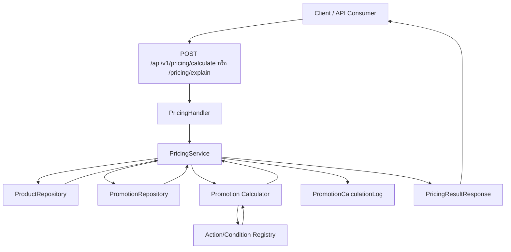
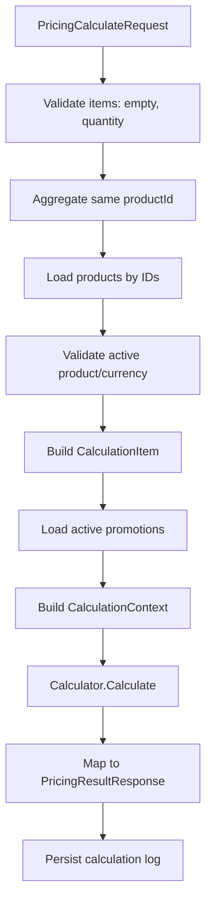
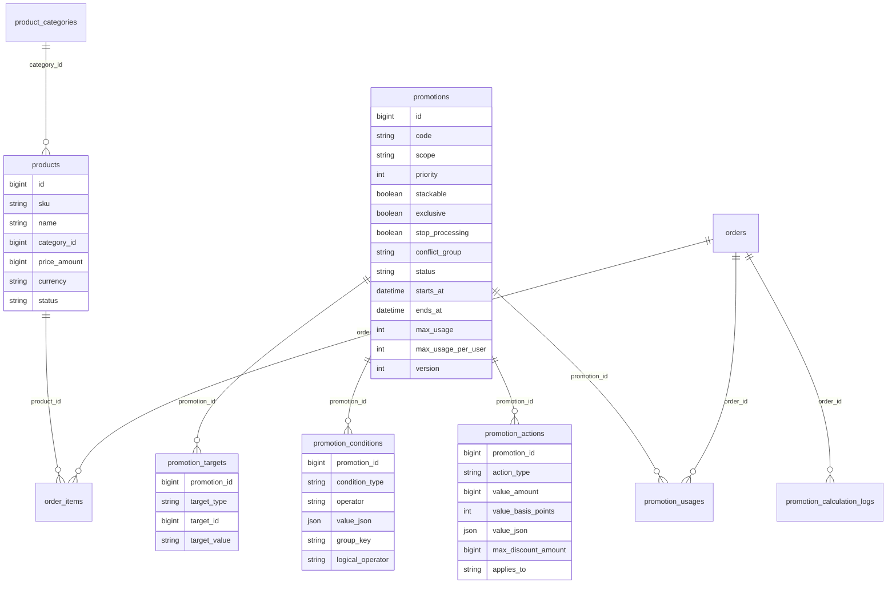
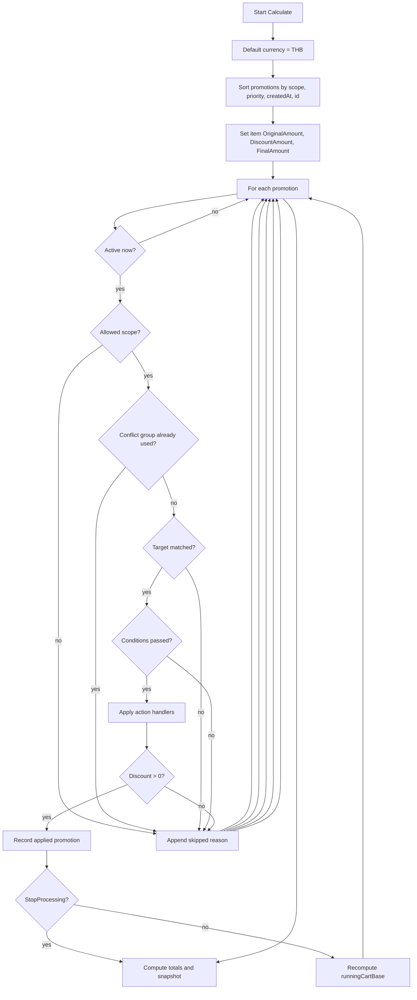
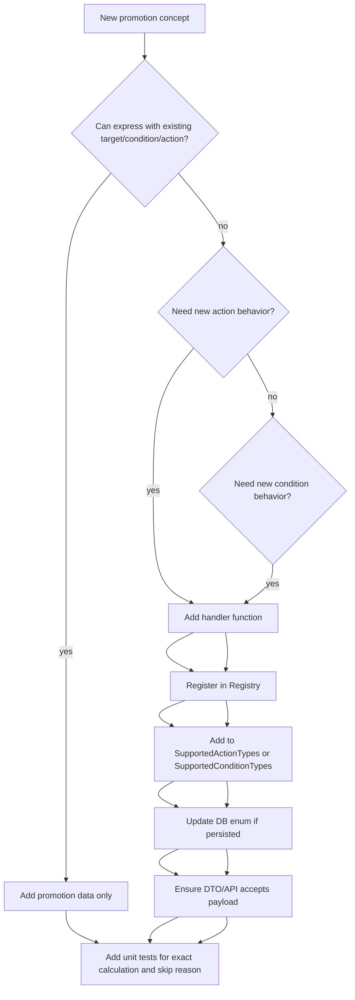

# Promotion System Design, Calculation Flow, and Test Proof

เอกสารนี้อธิบาย design ของระบบคำนวณราคาสุทธิของคำสั่งซื้อจากโค้ดในโปรเจกต์นี้โดยตรง โดยตอบโจทย์หลักให้ครบ:

1. ถ้าระบบรองรับ promotion แบบซ้อนกัน ต้องจัดลำดับคำนวณยังไง
2. ถ้าต้องการเพิ่ม promotion จะทำยังไงเพื่อไม่ให้กระทบ logic เดิม
3. ถ้าต้องการเพิ่ม promotion ใหม่ที่ไม่เคยมีมาก่อน จะ design ยังไงให้รองรับ
4. ใช้ design pattern อะไร
5. table design ยืดหยุ่นพอสำหรับ promotion ใหม่อย่างไร
6. คำนวณโปรโมชั่นถูกต้องอย่างไร และจะ proof ด้วย test/API อย่างไร

เอกสารนี้อ้างอิง implementation ปัจจุบัน ไม่ได้เขียนแบบลอย ๆ:

- Pricing orchestration: [`internal/service/pricing_service.go`](internal/service/pricing_service.go)
- Promotion calculation engine: [`internal/promotion/engine.go`](internal/promotion/engine.go)
- Promotion strategy registry: [`internal/promotion/registry.go`](internal/promotion/registry.go)
- Promotion/order/product models: [`internal/model/models.go`](internal/model/models.go)
- Promotion repository/query: [`internal/repository/promotion_repository.go`](internal/repository/promotion_repository.go)
- Database schema: [`database/schema.sql`](database/schema.sql)
- Seed data ตามโจทย์: [`database/seed.sql`](database/seed.sql)
- Unit tests ปัจจุบัน: [`test/unit/promotion/engine_test.go`](test/unit/promotion/engine_test.go)

---

## 1. Executive Summary

ระบบนี้ออกแบบเป็น promotion engine แบบ data-driven rule engine:

- Product และ promotion ถูกเก็บใน database
- Promotion 1 ตัวแยกเป็น `promotions` + `promotion_targets` + `promotion_conditions` + `promotion_actions`
- API/service ไม่ hardcode ว่า promotion ไหนลดอะไร
- Calculator โหลด promotion ที่ active แล้ว apply ตามลำดับที่ deterministic
- Action/condition ใช้ registry เพื่อให้เพิ่ม logic ใหม่ได้โดยไม่ต้อง rewrite core engine
- ผลคำนวณเก็บเป็น `OriginalTotal`, `DiscountTotal`, `FinalTotal`, item-level discount, applied promotion, skipped promotion และ calculation log

คำตอบสั้น ๆ ของโจทย์:

| คำถาม | คำตอบจาก design ปัจจุบัน |
|---|---|
| Promotion ซ้อนกันจัดลำดับยังไง | sort ตาม `scope -> priority -> created_at -> id` แล้ว apply ตามลำดับ `ITEM -> CART -> COUPON -> SHIPPING` |
| เพิ่ม promotion ยังไงไม่กระทบ logic เดิม | ถ้าใช้ action/condition/target เดิม ให้เพิ่ม data ใน DB/API ได้เลย ไม่ต้องแก้ engine |
| เพิ่ม promotion ใหม่ที่ไม่เคยมีมาก่อน | เพิ่ม action/condition handler ผ่าน `Registry`, เพิ่ม supported type ใน validation, เพิ่ม schema enum ถ้าต้อง persist ใน DB |
| Design pattern | Rule Engine, Strategy Pattern, Registry Pattern, Repository Pattern, Service Layer, Audit Log/Snapshot |
| Table design | Flexible rule model: header/target/condition/action แยกตาราง และใช้ `value_json` สำหรับ config ที่เปลี่ยนตามชนิด promotion |
| ความถูกต้อง | คำนวณด้วย minor units เป็น integer, percentage ใช้ basis points, cap ส่วนลดไม่ให้เกิน base, update running total หลังแต่ละ promotion |

---

## 2. ภาพรวม System Flow

### 2.1 Runtime Flow จาก API ถึง Engine



อ้างอิงโค้ด:

- Route `/pricing/calculate` และ `/pricing/explain` ถูกผูกใน [`cmd/server/main.go#L82`](cmd/server/main.go#L82)
- Handler parse request แล้วส่งต่อ service ใน [`internal/handler/pricing_handler.go#L18`](internal/handler/pricing_handler.go#L18)
- `PricingService` โหลด product, active promotion, เรียก calculator และ persist log ใน [`internal/service/pricing_service.go#L60`](internal/service/pricing_service.go#L60)
- Calculator คำนวณจริงใน [`internal/promotion/engine.go#L94`](internal/promotion/engine.go#L94)

### 2.2 Data Flow ภายใน PricingService



รายละเอียดสำคัญ:

- รวมรายการสินค้าซ้ำด้วย `aggregateItems` เพื่อให้ product เดียวกันถูกคำนวณเป็น item เดียวใน engine: [`internal/service/pricing_service.go#L210`](internal/service/pricing_service.go#L210)
- ตรวจสินค้า inactive และ currency mismatch ก่อนคำนวณ promotion: [`internal/service/pricing_service.go#L78`](internal/service/pricing_service.go#L78)
- สร้าง `CalculationItem` จาก product จริง ไม่เชื่อราคาที่ client ส่งมา: [`internal/service/pricing_service.go#L94`](internal/service/pricing_service.go#L94)
- โหลด active promotions จาก repository: [`internal/service/pricing_service.go#L113`](internal/service/pricing_service.go#L113)
- ส่ง coupon/payment/shipping context เข้า engine: [`internal/service/pricing_service.go#L118`](internal/service/pricing_service.go#L118)

---

## 3. Data Model และ Table Design

### 3.1 ERD ภาพรวม



### 3.2 ทำไม table design นี้ยืดหยุ่น

ระบบแยก promotion เป็น 4 ส่วน:

| ส่วน | ตาราง | หน้าที่ | ตัวอย่าง |
|---|---|---|---|
| Header | `promotions` | metadata, scope, priority, status, date, usage limit | `ITEM1_10_PERCENT`, scope `ITEM`, priority `10` |
| Target | `promotion_targets` | promotion นี้ใช้กับอะไร | product 1, category 5, cart |
| Condition | `promotion_conditions` | เงื่อนไขก่อนใช้ promotion | coupon code, minimum order, payment method |
| Action | `promotion_actions` | สิ่งที่จะทำเมื่อผ่านเงื่อนไข | ลด %, ลดจำนวนเงิน, free shipping |

ข้อดี:

- เพิ่ม promotion ใหม่ส่วนใหญ่ได้ด้วย data โดยไม่แก้ code
- promotion 1 ตัวมีได้หลาย target, หลาย condition, หลาย action
- `value_json` รองรับ config ที่แต่ละ condition/action ต้องใช้ไม่เหมือนกัน
- `priority`, `conflict_group`, `stop_processing` ใช้ควบคุม promotion stacking
- `max_usage`, `max_usage_per_user`, `promotion_usages` รองรับ usage limit ตอน confirm order
- `version` รองรับ optimistic locking ตอนแก้ promotion
- indexes แยกตาม active window, sort, target lookup, action lookup ทำให้ query promotion ได้เร็วขึ้น

อ้างอิง schema:

- `promotions`: [`database/schema.sql#L105`](database/schema.sql#L105)
- `promotion_targets`: [`database/schema.sql#L134`](database/schema.sql#L134)
- `promotion_conditions`: [`database/schema.sql#L149`](database/schema.sql#L149)
- `promotion_actions`: [`database/schema.sql#L177`](database/schema.sql#L177)
- `promotion_usages`: [`database/schema.sql#L207`](database/schema.sql#L207)
- `promotion_calculation_logs`: [`database/schema.sql#L229`](database/schema.sql#L229)
- promotion loading indexes: [`database/schema.sql#L286`](database/schema.sql#L286)

### 3.3 Money และ Percentage Encoding

ระบบนี้เก็บเงินเป็น minor units:

- `price_amount BIGINT`
- 100 บาท = `10000` ถ้าใช้ satang
- 1,000 บาท = `100000`

ระบบนี้เก็บ percentage เป็น basis points:

- 10% = `1000`
- 5% = `500`
- 100% = `10000`

อ้างอิง comment ใน schema: [`database/schema.sql#L3`](database/schema.sql#L3)

เหตุผล:

- เลี่ยง floating point error เช่น 0.1 + 0.2
- คำนวณ deterministic
- เหมาะกับระบบเงิน
- test ง่าย เพราะ expected value เป็น integer

---

## 4. คำตอบข้อ 1: Promotion ซ้อนกันต้องจัดลำดับคำนวณอย่างไร

### 4.1 ลำดับที่ใช้จริง

Calculator sort promotions ด้วยลำดับนี้:

1. `scope`
2. `priority`
3. `created_at`
4. `id`

อ้างอิงโค้ด sort: [`internal/promotion/engine.go#L101`](internal/promotion/engine.go#L101)

`scope` ถูก rank เป็น:

1. `ITEM`
2. `CART`
3. `COUPON`
4. `SHIPPING`
5. unknown scope เป็น `99`

อ้างอิง `scopeRank`: [`internal/promotion/engine.go#L538`](internal/promotion/engine.go#L538)

### 4.2 ทำไมต้องเรียงแบบนี้

การคำนวณ promotion แบบซ้อนกันต้องมีลำดับที่ชัดเจน เพราะผลลัพธ์ของ promotion ก่อนหน้าจะเป็นฐานของ promotion ถัดไป

ลำดับนี้มีเหตุผล:

| ลำดับ | Scope | เหตุผล |
|---|---|---|
| 1 | `ITEM` | ลดที่สินค้าเฉพาะก่อน เพื่อให้ item final amount ถูกต้อง |
| 2 | `CART` | ลดจากยอดรวมหลัง item discount |
| 3 | `COUPON` | ใช้ coupon หลังคำนวณ item/cart promotion แล้ว |
| 4 | `SHIPPING` | shipping เป็นค่าใช้จ่ายปลายทาง จึงควรอยู่ท้าย |

ตัวอย่าง:

- Product 1 ราคา 1,000 บาท ลด item 10% เหลือ 900 บาท
- Product 2 ราคา 500 บาท ลด item 100 บาท เหลือ 400 บาท
- ถ้ามี cart discount 5% จะคิดจาก 1,300 บาท ไม่ใช่ 1,500 บาท

### 4.3 Calculation Pipeline ใน Engine



จุดสำคัญในโค้ด:

- Init item amount: [`internal/promotion/engine.go#L126`](internal/promotion/engine.go#L126)
- Loop promotion ทีละตัว: [`internal/promotion/engine.go#L138`](internal/promotion/engine.go#L138)
- Check active/status/date: [`internal/promotion/engine.go#L139`](internal/promotion/engine.go#L139)
- Check conflict group: [`internal/promotion/engine.go#L146`](internal/promotion/engine.go#L146)
- Check target: [`internal/promotion/engine.go#L150`](internal/promotion/engine.go#L150)
- Check condition: [`internal/promotion/engine.go#L154`](internal/promotion/engine.go#L154)
- Apply action: [`internal/promotion/engine.go#L159`](internal/promotion/engine.go#L159)
- Recompute running base หลัง apply: [`internal/promotion/engine.go#L186`](internal/promotion/engine.go#L186)
- Final totals: [`internal/promotion/engine.go#L189`](internal/promotion/engine.go#L189)

### 4.4 การซ้อน promotion ด้วย runningCartBase

`runningCartBase` เริ่มจาก `originalTotal` แล้วหลัง apply promotion แต่ละตัวจะถูก recompute จาก item `FinalAmount`

```go
runningCartBase = computeCurrentCartBase(result.Items)
```

อ้างอิง: [`internal/promotion/engine.go#L186`](internal/promotion/engine.go#L186)

ผลคือ:

- promotion ถัดไปคำนวณจากยอดที่เหลือ
- cart/coupon discount ไม่ซ้ำซ้อนจากราคาเต็ม ถ้าก่อนหน้ามี item discount ไปแล้ว
- final total เป็นผลลัพธ์จาก item final amount รวมกัน

### 4.5 Conflict Group และ Stop Processing

Engine ปัจจุบัน enforce การไม่ให้ promotion บางกลุ่มซ้อนกันผ่าน:

- `conflict_group`
- `stop_processing`

ถ้า promotion A ถูก apply แล้วมี `conflict_group = "PRODUCT_DISCOUNT"` promotion ถัดไปที่มี group เดียวกันจะถูก skip ด้วย reason `CONFLICT_GROUP_BLOCKED`

อ้างอิง:

- Check conflict group: [`internal/promotion/engine.go#L146`](internal/promotion/engine.go#L146)
- Mark applied conflict group: [`internal/promotion/engine.go#L177`](internal/promotion/engine.go#L177)
- Stop processing: [`internal/promotion/engine.go#L181`](internal/promotion/engine.go#L181)

ข้อสังเกตสำคัญ:

- field `Stackable` และ `Exclusive` มีอยู่ใน model/schema แล้ว แต่ engine ปัจจุบันยังไม่ได้ enforce boolean สองตัวนี้โดยตรง
- behavior ที่ใช้จริงตอนนี้คือ `conflict_group` และ `stop_processing`
- ถ้าต้องการให้ `Exclusive=true` หยุด promotion ทั้งหมด ต้องเพิ่ม rule ใน engine หรือ map `Exclusive` ให้ตั้ง `StopProcessing=true`

---

## 5. คำตอบข้อ 2: เพิ่ม Promotion โดยไม่กระทบ Logic เดิมทำอย่างไร

### 5.1 กรณีเพิ่ม promotion จาก primitive เดิม

ถ้า promotion ใหม่ใช้ target/condition/action ที่ระบบรองรับอยู่แล้ว ให้เพิ่ม data ได้เลย ไม่ต้องแก้ engine

ตัวอย่าง primitive ที่รองรับจริงใน registry:

| Type | รองรับจาก code | อ้างอิง |
|---|---|---|
| `PERCENTAGE_DISCOUNT` | ลด % ระดับ item/cart | [`internal/promotion/registry.go#L81`](internal/promotion/registry.go#L81) |
| `FIXED_AMOUNT_DISCOUNT` | ลดจำนวนเงินระดับ item/cart | [`internal/promotion/registry.go#L84`](internal/promotion/registry.go#L84) |
| `CART_PERCENTAGE_DISCOUNT` | ลด % จาก cart | [`internal/promotion/registry.go#L83`](internal/promotion/registry.go#L83) |
| `CART_FIXED_AMOUNT_DISCOUNT` | ลดเงินจาก cart | [`internal/promotion/registry.go#L85`](internal/promotion/registry.go#L85) |
| `FREE_SHIPPING` | มี handler แล้ว แต่ยังไม่ลดเงินเพราะยังไม่มี shipping fee ใน calculation context | [`internal/promotion/engine.go#L292`](internal/promotion/engine.go#L292) |

Condition ที่รองรับจริง:

| Condition | ใช้ทำอะไร | อ้างอิง |
|---|---|---|
| `MIN_ORDER_AMOUNT` | ยอดขั้นต่ำ | [`internal/promotion/engine.go#L296`](internal/promotion/engine.go#L296) |
| `MAX_ORDER_AMOUNT` | ยอดสูงสุด | [`internal/promotion/engine.go#L304`](internal/promotion/engine.go#L304) |
| `COUPON_CODE` | ต้องมี coupon code ตรงกัน | [`internal/promotion/engine.go#L312`](internal/promotion/engine.go#L312) |
| `PAYMENT_METHOD` | ต้องจ่ายด้วยวิธีที่กำหนด | [`internal/promotion/engine.go#L322`](internal/promotion/engine.go#L322) |
| `PRODUCT_ID` | ต้องมี product ที่กำหนด | [`internal/promotion/engine.go#L330`](internal/promotion/engine.go#L330) |
| `CATEGORY_ID` | ต้องมี category ที่กำหนด | [`internal/promotion/engine.go#L340`](internal/promotion/engine.go#L340) |
| `DATE_RANGE` | อยู่ในช่วงวันที่กำหนด | [`internal/promotion/engine.go#L350`](internal/promotion/engine.go#L350) |
| `USER_SEGMENT`, `FIRST_ORDER` | ตอนนี้เป็น passthrough | [`internal/promotion/engine.go#L364`](internal/promotion/engine.go#L364) |

### 5.2 ตัวอย่างเพิ่ม promotion แบบไม่แก้ code

ตัวอย่าง: เพิ่ม coupon ลด 50 บาท เมื่อใส่ code `SAVE50`

```sql
INSERT INTO promotions (
  code, name, description, scope, priority, stackable, exclusive, stop_processing,
  conflict_group, status, starts_at, ends_at, version
) VALUES (
  'SAVE50', 'Coupon Save 50 THB', 'Cart coupon discount 50 THB',
  'COUPON', 20, TRUE, FALSE, FALSE,
  'COUPON_DISCOUNT', 'ACTIVE',
  '2026-01-01 00:00:00.000', '2026-12-31 23:59:59.999', 1
);

SET @promotion_id = LAST_INSERT_ID();

INSERT INTO promotion_targets (promotion_id, target_type, target_id, target_value)
VALUES (@promotion_id, 'CART', NULL, NULL);

INSERT INTO promotion_conditions (
  promotion_id, condition_type, operator, value_json, logical_operator
) VALUES (
  @promotion_id, 'COUPON_CODE', 'EQ', JSON_QUOTE('SAVE50'), 'AND'
);

INSERT INTO promotion_actions (
  promotion_id, action_type, value_amount, value_basis_points,
  value_json, max_discount_amount, applies_to
) VALUES (
  @promotion_id, 'CART_FIXED_AMOUNT_DISCOUNT', 5000, NULL,
  NULL, NULL, 'CART'
);
```

ทำไมไม่กระทบ logic เดิม:

- engine ไม่ต้องรู้ว่า code `SAVE50` คืออะไร
- condition handler `COUPON_CODE` อ่าน `value_json`
- action handler `CART_FIXED_AMOUNT_DISCOUNT` อ่าน `value_amount`
- promotion ถูก sort ตาม scope/priority เหมือนตัวอื่น
- ถ้า coupon ไม่ตรงจะถูก skip เป็น `COUPON_CODE_MISMATCH`

### 5.3 ตัวอย่างเพิ่ม card/payment promotion

ตัวอย่าง: จ่ายด้วย `VISA` ลด cart 5% แต่ลดสูงสุด 100 บาท

```sql
INSERT INTO promotions (
  code, name, description, scope, priority, stackable, exclusive, stop_processing,
  conflict_group, status, starts_at, ends_at, version
) VALUES (
  'VISA_5_PERCENT_MAX100', 'VISA 5% max 100 THB', 'Payment method promotion',
  'CART', 30, TRUE, FALSE, FALSE,
  'PAYMENT_DISCOUNT', 'ACTIVE',
  '2026-01-01 00:00:00.000', '2026-12-31 23:59:59.999', 1
);

SET @promotion_id = LAST_INSERT_ID();

INSERT INTO promotion_targets (promotion_id, target_type, target_id, target_value)
VALUES (@promotion_id, 'CART', NULL, NULL);

INSERT INTO promotion_conditions (
  promotion_id, condition_type, operator, value_json, logical_operator
) VALUES (
  @promotion_id, 'PAYMENT_METHOD', 'EQ', JSON_QUOTE('VISA'), 'AND'
);

INSERT INTO promotion_actions (
  promotion_id, action_type, value_amount, value_basis_points,
  value_json, max_discount_amount, applies_to
) VALUES (
  @promotion_id, 'CART_PERCENTAGE_DISCOUNT', NULL, 500,
  NULL, 10000, 'CART'
);
```

Request ที่ต้องส่ง:

```json
{
  "items": [
    {"productId": 1, "quantity": 1},
    {"productId": 2, "quantity": 1}
  ],
  "couponCodes": [],
  "paymentMethod": "VISA",
  "currency": "THB"
}
```

---

## 6. คำตอบข้อ 3: เพิ่ม Promotion ใหม่ที่ไม่เคยมีมาก่อน Design อย่างไร

### 6.1 Strategy + Registry Extension Flow



### 6.2 ต้องแก้ไฟล์ไหนบ้างถ้าเพิ่ม action ใหม่จริง

สมมติจะเพิ่ม `LOYALTY_BONUS`

1. เพิ่ม handler ใน [`internal/promotion/engine.go`](internal/promotion/engine.go)
2. register handler ใน [`internal/promotion/registry.go#L81`](internal/promotion/registry.go#L81)
3. เพิ่มชื่อ action ใน `SupportedActionTypes()` ที่ [`internal/promotion/registry.go#L57`](internal/promotion/registry.go#L57)
4. เพิ่ม enum ใน `promotion_actions.action_type` ที่ [`database/schema.sql#L180`](database/schema.sql#L180)
5. ถ้ามี migration ให้เพิ่ม migration สำหรับ enum/action type
6. เพิ่ม validation/unit test ที่ [`test/unit/promotion/engine_test.go`](test/unit/promotion/engine_test.go)

### 6.3 Proof ว่า registry รองรับ action ใหม่ได้จริง

test ปัจจุบันมีตัวอย่าง register action ใหม่ชื่อ `LOYALTY_BONUS` โดยไม่แก้ core loop:

- สร้าง registry ใหม่: [`test/unit/promotion/engine_test.go#L98`](test/unit/promotion/engine_test.go#L98)
- register action ใหม่: [`test/unit/promotion/engine_test.go#L99`](test/unit/promotion/engine_test.go#L99)
- ใช้ `NewCalculatorWithRegistry`: [`test/unit/promotion/engine_test.go#L104`](test/unit/promotion/engine_test.go#L104)
- assert discount/final total: [`test/unit/promotion/engine_test.go#L123`](test/unit/promotion/engine_test.go#L123)

นี่คือ proof ของ Strategy/Registry Pattern ว่าเพิ่ม behavior ใหม่ได้โดยไม่ต้อง rewrite `Calculate()`

---

## 7. Design Patterns ที่ใช้จริง

### 7.1 Rule Engine Pattern

Promotion engine ทำหน้าที่ evaluate rule:

1. sort rules
2. check active window
3. check target
4. check condition
5. execute action
6. aggregate result

อ้างอิง main rule loop: [`internal/promotion/engine.go#L138`](internal/promotion/engine.go#L138)

ประโยชน์:

- logic การคำนวณอยู่ที่เดียว
- API/controller ไม่ต้องรู้รายละเอียด promotion
- เพิ่ม promotion ด้วย data ได้
- ควบคุมลำดับและ skip reason ได้

### 7.2 Strategy Pattern

Action และ condition แยกเป็น handler:

```go
type ActionHandler func(ActionContext) (int64, error)
type ConditionHandler func(ConditionContext) (bool, string, error)
```

อ้างอิง: [`internal/promotion/registry.go#L20`](internal/promotion/registry.go#L20)

ประโยชน์:

- action แต่ละชนิดมี algorithm ของตัวเอง
- condition แต่ละชนิดมี evaluator ของตัวเอง
- engine core ไม่ต้องมี `if actionType == ...` จำนวนมาก
- test เฉพาะ strategy ใหม่ได้

### 7.3 Registry Pattern

Registry map `actionType` และ `conditionType` ไปยัง handler:

- Register action: [`internal/promotion/registry.go#L39`](internal/promotion/registry.go#L39)
- Register condition: [`internal/promotion/registry.go#L43`](internal/promotion/registry.go#L43)
- Lookup action ตอน apply: [`internal/promotion/engine.go#L203`](internal/promotion/engine.go#L203)
- Lookup condition ตอน evaluate: [`internal/promotion/engine.go#L233`](internal/promotion/engine.go#L233)

ประโยชน์:

- เปิดให้ extension ได้
- เพิ่ม custom registry ใน test ได้
- แยก default strategies ออกจาก engine lifecycle

### 7.4 Repository Pattern

Promotion loading ถูกซ่อนหลัง repository:

- interface: [`internal/repository/promotion_repository.go#L36`](internal/repository/promotion_repository.go#L36)
- load active promotions พร้อม preload target/condition/action: [`internal/repository/promotion_repository.go#L66`](internal/repository/promotion_repository.go#L66)

ประโยชน์:

- service ไม่ต้องเขียน SQL เอง
- query active promotion ถูกควบคุมในที่เดียว
- test mock repository ได้ง่ายกว่า

### 7.5 Service Layer

`PricingService` orchestrate use case:

- validate input
- load product
- load promotion
- call calculator
- persist calculation log

อ้างอิง: [`internal/service/pricing_service.go#L60`](internal/service/pricing_service.go#L60)

ประโยชน์:

- handler บาง
- business flow อยู่ใน service
- engine ไม่ผูกกับ database

### 7.6 Audit Log / Snapshot Pattern

ผลคำนวณถูก persist ที่ `promotion_calculation_logs`

อ้างอิง:

- persist log: [`internal/service/pricing_service.go#L184`](internal/service/pricing_service.go#L184)
- schema log: [`database/schema.sql#L229`](database/schema.sql#L229)

ประโยชน์:

- debug ได้ว่า request ไหนได้ final total เท่าไร
- เก็บ applied/skipped promotion
- replay/ตรวจสอบย้อนหลังได้
- ใช้เป็น proof เวลา confirm order

---

## 8. Calculation Correctness

### 8.1 สูตรหลัก

สำหรับ item:

```text
OriginalAmount = UnitPrice * Quantity
FinalAmount เริ่มต้น = OriginalAmount
DiscountAmount เริ่มต้น = 0
```

อ้างอิง: [`internal/promotion/engine.go#L126`](internal/promotion/engine.go#L126)

สำหรับ percentage:

```text
Discount = BaseAmount * ValueBasisPoints / 10000
```

อ้างอิง: [`internal/promotion/engine.go#L253`](internal/promotion/engine.go#L253)

สำหรับ fixed amount:

```text
Discount = min(ValueAmount, BaseAmount)
```

อ้างอิง: [`internal/promotion/engine.go#L271`](internal/promotion/engine.go#L271)

สำหรับ final:

```text
DiscountTotal = OriginalTotal - sum(Item.FinalAmount)
FinalTotal = sum(Item.FinalAmount)
```

อ้างอิง: [`internal/promotion/engine.go#L189`](internal/promotion/engine.go#L189)

### 8.2 ป้องกัน discount เกินราคา

ระบบมี guard หลายชั้น:

- fixed discount cap ด้วย base amount: [`internal/promotion/engine.go#L283`](internal/promotion/engine.go#L283)
- percentage/fixed cap ด้วย `max_discount_amount`: [`internal/promotion/engine.go#L265`](internal/promotion/engine.go#L265), [`internal/promotion/engine.go#L286`](internal/promotion/engine.go#L286)
- cart discount cap ด้วย cart base: [`internal/promotion/engine.go#L424`](internal/promotion/engine.go#L424)
- allocation ไม่ให้ item final ติดลบ: [`internal/promotion/engine.go#L390`](internal/promotion/engine.go#L390), [`internal/promotion/engine.go#L433`](internal/promotion/engine.go#L433)
- final total guard ไม่ให้ติดลบ: [`internal/promotion/engine.go#L192`](internal/promotion/engine.go#L192)

### 8.3 Allocation ของ cart discount ลง item

เวลา discount ระดับ cart ระบบไม่ได้ลดแค่ order total แต่กระจายส่วนลดลง item ตามสัดส่วน `FinalAmount`

```text
share = item.FinalAmount * cartDiscount / cartBase
```

อ้างอิง: [`internal/promotion/engine.go#L432`](internal/promotion/engine.go#L432)

ถ้ามีเศษจาก integer division ระบบวนปรับ remainder ให้ item ที่ยังมี final amount เหลือ:

- item discount remainder: [`internal/promotion/engine.go#L398`](internal/promotion/engine.go#L398)
- cart discount remainder: [`internal/promotion/engine.go#L440`](internal/promotion/engine.go#L440)

เหตุผล:

- ผลรวม item final amount ต้องตรงกับ final total
- ไม่มี item final amount ติดลบ
- rounding deterministic

---

## 9. Proof ด้วยข้อมูล Seed ตามโจทย์

Seed ปัจจุบันสร้าง:

- Product 1 ราคา `100000` minor units = 1,000 บาท
- Product 2 ราคา `50000` minor units = 500 บาท
- Promotion 1: Product 1 ลด 10%
- Promotion 2: Product 2 ลด 100 บาท

อ้างอิง:

- products ใน seed: [`database/seed.sql#L5`](database/seed.sql#L5)
- promotions ใน seed: [`database/seed.sql#L17`](database/seed.sql#L17)
- targets/actions ใน seed: [`database/seed.sql#L47`](database/seed.sql#L47)

### 9.1 Expected Calculation

Input:

```json
{
  "items": [
    {"productId": 1, "quantity": 1},
    {"productId": 2, "quantity": 1}
  ],
  "currency": "THB"
}
```

Calculation:

| Item | Original | Promotion | Discount | Final |
|---|---:|---|---:|---:|
| Product 1 | 100000 | 10% | 10000 | 90000 |
| Product 2 | 50000 | fixed 100 THB | 10000 | 40000 |
| Total | 150000 | | 20000 | 130000 |

Expected response:

```json
{
  "originalTotal": 150000,
  "discountTotal": 20000,
  "finalTotal": 130000,
  "currency": "THB"
}
```

หมายเหตุสำคัญ: seed ตั้ง `conflict_group` ของ promotion 1 และ 2 เป็น `PRODUCT_DISCOUNT` เหมือนกัน ดังนั้น engine ปัจจุบันจะ apply promotion แรกแล้ว block promotion ที่สองด้วย `CONFLICT_GROUP_BLOCKED` ถ้า seed ถูกใช้ตามนี้ตรง ๆ

ถ้าต้องการให้โจทย์ตัวอย่าง apply ได้ทั้งสองตัวพร้อมกัน ต้องปรับอย่างใดอย่างหนึ่ง:

1. ให้ `conflict_group` ของ Product 1 และ Product 2 ต่างกัน เช่น `PRODUCT_1_DISCOUNT`, `PRODUCT_2_DISCOUNT`
2. หรือ set `conflict_group = NULL`

เหตุผลคือ engine ใช้ conflict group เพื่อกัน promotion ในกลุ่มเดียวกันซ้อนกัน อ้างอิง [`internal/promotion/engine.go#L146`](internal/promotion/engine.go#L146)

### 9.2 SQL ปรับ seed ให้สอง item promotions ซ้อนกันได้

ถ้าต้องการ demo ให้ Product 1 และ Product 2 discount ติดพร้อมกัน:

```sql
UPDATE promotions
SET conflict_group = NULL
WHERE code IN ('ITEM1_10_PERCENT', 'ITEM2_MINUS_100');
```

หรือ:

```sql
UPDATE promotions
SET conflict_group = 'PRODUCT_1_DISCOUNT'
WHERE code = 'ITEM1_10_PERCENT';

UPDATE promotions
SET conflict_group = 'PRODUCT_2_DISCOUNT'
WHERE code = 'ITEM2_MINUS_100';
```

---

## 10. API Test วิธีรันจริง

### 10.1 Start ระบบ

```bash
docker compose up --build
```

ถ้าต้องการล้างฐานแล้ว seed ใหม่:

```bash
docker compose down -v
docker compose up --build
```

### 10.2 Health Check

```bash
curl http://localhost:3000/api/v1/healthz
curl http://localhost:3000/api/v1/readyz
```

### 10.3 Pricing Calculate จาก seed

```bash
curl -s -X POST http://localhost:3000/api/v1/pricing/calculate \
  -H 'Content-Type: application/json' \
  -d '{
    "items": [
      {"productId": 1, "quantity": 1},
      {"productId": 2, "quantity": 1}
    ],
    "currency": "THB"
  }'
```

สิ่งที่ต้องตรวจ:

- `originalTotal` ต้องเป็นผลรวมราคาสินค้า
- `discountTotal` ต้องเท่ากับผลรวมส่วนลดที่ apply จริง
- `finalTotal = originalTotal - discountTotal`
- `items[].discountAmount` ต้องรวมกันเท่ากับ `discountTotal`
- `appliedPromotions` ต้องมี promotion ที่ apply
- `skippedPromotions` ต้องบอกเหตุผลของ promotion ที่ไม่ apply เช่น `CONFLICT_GROUP_BLOCKED`, `TARGET_MISMATCH`, `COUPON_CODE_MISMATCH`

### 10.4 Pricing Explain

```bash
curl -s -X POST http://localhost:3000/api/v1/pricing/explain \
  -H 'Content-Type: application/json' \
  -d '{
    "items": [
      {"productId": 1, "quantity": 1},
      {"productId": 2, "quantity": 1}
    ],
    "currency": "THB"
  }'
```

`/pricing/explain` ใช้ service path เดียวกับ calculate แต่ตั้ง `explain=true` ใน snapshot log อ้างอิง [`internal/service/pricing_service.go#L52`](internal/service/pricing_service.go#L52)

### 10.5 ทดสอบ coupon promotion

หลังเพิ่ม coupon `SAVE50` ตาม SQL ใน section 5.2:

```bash
curl -s -X POST http://localhost:3000/api/v1/pricing/calculate \
  -H 'Content-Type: application/json' \
  -d '{
    "items": [
      {"productId": 1, "quantity": 1}
    ],
    "couponCodes": ["SAVE50"],
    "currency": "THB"
  }'
```

Expected:

- ถ้า Product 1 ราคา 100000 และมี item discount 10% ด้วย ระบบจะลด item ก่อน
- coupon scope `COUPON` จะถูกคำนวณหลัง `ITEM` และ `CART`
- ถ้า coupon match จะลดเพิ่ม 5000 minor units
- ถ้าไม่ส่ง coupon code จะเห็น skip reason `COUPON_CODE_MISMATCH`

### 10.6 ทดสอบ payment/card promotion

หลังเพิ่ม payment promotion `VISA_5_PERCENT_MAX100` ตาม SQL section 5.3:

```bash
curl -s -X POST http://localhost:3000/api/v1/pricing/calculate \
  -H 'Content-Type: application/json' \
  -d '{
    "items": [
      {"productId": 1, "quantity": 1},
      {"productId": 2, "quantity": 1}
    ],
    "paymentMethod": "VISA",
    "currency": "THB"
  }'
```

Expected:

- ถ้า `paymentMethod = "VISA"` ผ่าน condition
- ถ้าใช้ payment method อื่นจะ skip ด้วย `PAYMENT_METHOD_MISMATCH`
- discount จะถูก cap ด้วย `max_discount_amount`

### 10.7 ทดสอบ min order promotion

ตัวอย่าง promotion ลด cart 100 บาท เมื่อยอดหลัง item discount อย่างน้อย 1,000 บาท:

```sql
INSERT INTO promotions (
  code, name, description, scope, priority, stackable, exclusive, stop_processing,
  conflict_group, status, starts_at, ends_at, version
) VALUES (
  'MIN1000_MINUS100', 'Min 1000 minus 100 THB', 'Cart fixed discount by minimum order',
  'CART', 40, TRUE, FALSE, FALSE,
  'CART_DISCOUNT', 'ACTIVE',
  '2026-01-01 00:00:00.000', '2026-12-31 23:59:59.999', 1
);

SET @promotion_id = LAST_INSERT_ID();

INSERT INTO promotion_targets (promotion_id, target_type, target_id, target_value)
VALUES (@promotion_id, 'CART', NULL, NULL);

INSERT INTO promotion_conditions (
  promotion_id, condition_type, operator, value_json, logical_operator
) VALUES (
  @promotion_id, 'MIN_ORDER_AMOUNT', 'GTE', '100000', 'AND'
);

INSERT INTO promotion_actions (
  promotion_id, action_type, value_amount, applies_to
) VALUES (
  @promotion_id, 'CART_FIXED_AMOUNT_DISCOUNT', 10000, 'CART'
);
```

Expected:

- ถ้า `runningCartBase >= 100000` apply
- ถ้าต่ำกว่า skip `MIN_ORDER_AMOUNT_NOT_MET`
- base ที่ใช้คือยอดปัจจุบันหลัง promotion ก่อนหน้า ไม่ใช่ always original total

---

## 11. Unit Test วิธีรันจริง

### 11.1 รันทั้งหมด

```bash
go test ./...
```

หรือผ่าน Docker builder ตาม environment ของโปรเจกต์:

```bash
docker build --target builder -t homework_design_implements_system-builder .
docker run --rm -v /mnt/c/Homework_Design_Implements_System:/workspace -w /workspace homework_design_implements_system-builder go test ./...
```

### 11.2 รันเฉพาะ promotion engine

```bash
go test ./test/unit/promotion -v
```

### 11.3 Test ปัจจุบันครอบคลุมอะไร

| Test | File | ครอบคลุม |
|---|---|---|
| `TestCalculator_ItemAndCartPromotions` | [`test/unit/promotion/engine_test.go#L12`](test/unit/promotion/engine_test.go#L12) | item promotion + cart promotion + stacking invariant |
| `TestCalculator_SkipsInactivePromotion` | [`test/unit/promotion/engine_test.go#L70`](test/unit/promotion/engine_test.go#L70) | inactive promotion ไม่ถูก apply |
| `TestCalculator_CustomRegisteredAction` | [`test/unit/promotion/engine_test.go#L97`](test/unit/promotion/engine_test.go#L97) | เพิ่ม custom action ผ่าน registry ได้ |
| `TestPromotionCreate_AcceptsValidPayload` | [`test/unit/handler/promotion_pricing_handler_test.go#L83`](test/unit/handler/promotion_pricing_handler_test.go#L83) | create promotion payload ผ่าน handler |
| `TestPricingExplain_Success` | [`test/unit/handler/promotion_pricing_handler_test.go#L161`](test/unit/handler/promotion_pricing_handler_test.go#L161) | pricing explain endpoint success |
| `TestPricingCalculate_EmptyItems` | [`test/unit/handler/promotion_pricing_handler_test.go#L139`](test/unit/handler/promotion_pricing_handler_test.go#L139) | empty item validation |
| `TestPromotionActivate_VersionConflict` | [`test/unit/handler/promotion_pricing_handler_test.go#L190`](test/unit/handler/promotion_pricing_handler_test.go#L190) | optimistic version conflict |
| `TestOrderConfirm_Success` | [`test/unit/handler/order_handler_test.go#L34`](test/unit/handler/order_handler_test.go#L34) | confirm order happy path |
| `TestOrderConfirm_PriceChanged` | [`test/unit/handler/order_handler_test.go#L85`](test/unit/handler/order_handler_test.go#L85) | accepted final total mismatch |

### 11.4 Test case ที่ควรเพิ่มเพื่อ proof ให้ครบขึ้น

ตารางนี้เป็น recommended test matrix สำหรับ promotion engine:

| Case | Input | Expected |
|---|---|---|
| Item percentage exact | Product 1 100000, 10% | discount 10000, final 90000 |
| Item fixed exact | Product 2 50000, fixed 10000 | discount 10000, final 40000 |
| Item + cart stacking exact | item discount ก่อน, cart 5% หลัง | cart 5% คิดจากยอดหลัง item discount |
| Coupon matched | coupon `SAVE50` | apply coupon discount |
| Coupon missing | no coupon | skipped `COUPON_CODE_MISMATCH` |
| Payment matched | `paymentMethod=VISA` | apply card/payment promotion |
| Payment mismatch | `paymentMethod=CASH` | skipped `PAYMENT_METHOD_MISMATCH` |
| Min order passed | running cart base >= threshold | apply |
| Min order failed | running cart base < threshold | skipped `MIN_ORDER_AMOUNT_NOT_MET` |
| Target mismatch | promotion target product 99 แต่ cart ไม่มี | skipped `TARGET_MISMATCH` |
| Conflict group | promo A และ B group เดียวกัน | A apply, B skipped `CONFLICT_GROUP_BLOCKED` |
| Stop processing | promo A `stop_processing=true` | promotion หลัง A ไม่ถูก evaluate |
| Cap max discount | 50% max 10000 | discount ไม่เกิน 10000 |
| Fixed greater than base | fixed 999999 กับ base 50000 | discount capped at 50000 |
| Unsupported action | action ไม่มีใน registry | skipped `ACTION_STRATEGY_NOT_SUPPORTED` |
| Date out of range | now นอก range | ไม่ apply |

### 11.5 ตัวอย่าง unit test exact calculation ที่ควรเพิ่ม

ตัวอย่างนี้พิสูจน์โจทย์ตรง ๆ ว่าสินค้า 1 ลด 10% และสินค้า 2 ลด 100 บาท แล้วได้ final ถูกต้อง:

```go
func TestCalculator_ItemPromotionsExactTotals(t *testing.T) {
    code1 := "ITEM1_10_PERCENT"
    code2 := "ITEM2_MINUS_100"

    calculator := promotion.NewCalculator()
    result, err := calculator.Calculate(nil, promotion.CalculationContext{
        Now: time.Date(2026, 6, 10, 0, 0, 0, 0, time.UTC),
        Items: []promotion.CalculationItem{
            {ProductID: 1, SKU: "P1", ProductName: "Product 1", CategoryID: 1, Quantity: 1, UnitPrice: 100000},
            {ProductID: 2, SKU: "P2", ProductName: "Product 2", CategoryID: 1, Quantity: 1, UnitPrice: 50000},
        },
        Promotions: []model.Promotion{
            {
                BaseModel: model.BaseModel{ID: 1, CreatedAt: time.Date(2026, 1, 1, 0, 0, 0, 0, time.UTC)},
                Code: &code1, Name: "Product 1 10%", Scope: "ITEM", Priority: 10, Status: "ACTIVE",
                StartsAt: time.Date(2026, 1, 1, 0, 0, 0, 0, time.UTC),
                EndsAt: time.Date(2026, 12, 31, 23, 59, 59, 0, time.UTC),
                Targets: []model.PromotionTarget{{TargetType: "PRODUCT", TargetID: uint64Ptr(1)}},
                Actions: []model.PromotionAction{{ActionType: "PERCENTAGE_DISCOUNT", ValueBasisPoints: intPtr(1000), AppliesTo: "ITEM"}},
            },
            {
                BaseModel: model.BaseModel{ID: 2, CreatedAt: time.Date(2026, 1, 2, 0, 0, 0, 0, time.UTC)},
                Code: &code2, Name: "Product 2 minus 100", Scope: "ITEM", Priority: 10, Status: "ACTIVE",
                StartsAt: time.Date(2026, 1, 1, 0, 0, 0, 0, time.UTC),
                EndsAt: time.Date(2026, 12, 31, 23, 59, 59, 0, time.UTC),
                Targets: []model.PromotionTarget{{TargetType: "PRODUCT", TargetID: uint64Ptr(2)}},
                Actions: []model.PromotionAction{{ActionType: "FIXED_AMOUNT_DISCOUNT", ValueAmount: int64Ptr(10000), AppliesTo: "ITEM"}},
            },
        },
    })

    assert.NoError(t, err)
    assert.Equal(t, int64(150000), result.OriginalTotal)
    assert.Equal(t, int64(20000), result.DiscountTotal)
    assert.Equal(t, int64(130000), result.FinalTotal)
    assert.Len(t, result.AppliedPromotions, 2)
}
```

หมายเหตุ: ใน seed ใช้ 100 บาท = `10000` minor units แต่ test ปัจจุบัน `TestCalculator_ItemAndCartPromotions` ใช้ `int64Ptr(100)` สำหรับ fixed amount ซึ่งหมายถึง 1 บาทถ้าใช้ satang convention ดังนั้น test ปัจจุบันพิสูจน์ invariant มากกว่า exact business example

---

## 12. Promotion Type Coverage

### 12.1 Product Discount

รองรับแล้ว:

- Target: `PRODUCT`
- Scope: `ITEM`
- Action: `PERCENTAGE_DISCOUNT` หรือ `FIXED_AMOUNT_DISCOUNT`

ตัวอย่าง:

- Product 1 ลด 10%
- Product 2 ลด 100 บาท

อ้างอิง:

- target matching: [`internal/promotion/engine.go#L460`](internal/promotion/engine.go#L460)
- matched item indexes: [`internal/promotion/engine.go#L491`](internal/promotion/engine.go#L491)
- item allocation: [`internal/promotion/engine.go#L368`](internal/promotion/engine.go#L368)

### 12.2 Category Discount

รองรับแล้ว:

- Target: `CATEGORY`
- Scope: `ITEM`
- Action: percentage/fixed

ใช้เมื่ออยากลดสินค้าทั้งหมวด เช่น category 1 ลด 15%

อ้างอิง category target matching: [`internal/promotion/engine.go#L477`](internal/promotion/engine.go#L477)

### 12.3 Cart Discount

รองรับแล้ว:

- Target: `CART`
- Scope: `CART`
- Action: `CART_PERCENTAGE_DISCOUNT` หรือ `CART_FIXED_AMOUNT_DISCOUNT`
- Conditions เช่น min/max order

อ้างอิง cart allocation: [`internal/promotion/engine.go#L420`](internal/promotion/engine.go#L420)

### 12.4 Coupon

รองรับแล้วในเชิง condition:

- Scope ควรใช้ `COUPON`
- Target ใช้ `CART`
- Condition ใช้ `COUPON_CODE`
- Action ใช้ cart fixed/percentage

อ้างอิง coupon condition: [`internal/promotion/engine.go#L312`](internal/promotion/engine.go#L312)

### 12.5 Card / Payment Method

รองรับแล้วในเชิง condition:

- Condition ใช้ `PAYMENT_METHOD`
- request ส่ง `paymentMethod`
- Action ใช้ cart discount

อ้างอิง payment condition: [`internal/promotion/engine.go#L322`](internal/promotion/engine.go#L322)

### 12.6 Free Shipping

สถานะปัจจุบัน:

- `FREE_SHIPPING` ถูก register แล้ว
- แต่ handler คืน discount `0`
- engine จะถือว่า `discount <= 0` แล้ว skip เป็น `NO_DISCOUNT`
- request มี `shipping.method` แต่ยังไม่มี `shipping fee amount`

อ้างอิง:

- register free shipping: [`internal/promotion/registry.go#L86`](internal/promotion/registry.go#L86)
- handler free shipping: [`internal/promotion/engine.go#L292`](internal/promotion/engine.go#L292)
- no discount skip: [`internal/promotion/engine.go#L164`](internal/promotion/engine.go#L164)

ถ้าจะรองรับจริง ต้องเพิ่ม:

1. `ShippingAmount` ใน `CalculationContext` หรือแยก `ShippingLine`
2. `ShippingDiscountAmount` ใน `CalculationResult`
3. ให้ `FREE_SHIPPING` return discount เท่าค่าส่ง หรือ set shipping final = 0
4. รวม shipping ใน final total ตาม business rule
5. เพิ่ม unit test free shipping exact

### 12.7 Buy X Get Y / Bundle Discount

สถานะปัจจุบัน:

- schema enum มี `BUY_X_GET_Y` และ `BUNDLE_DISCOUNT`
- แต่ `SupportedActionTypes()` ยังไม่รวมสองตัวนี้
- registry ยังไม่มี handler
- API validation จะ reject action type นี้

อ้างอิง:

- schema enum: [`database/schema.sql#L180`](database/schema.sql#L180)
- supported actions ปัจจุบัน: [`internal/promotion/registry.go#L57`](internal/promotion/registry.go#L57)
- validation reject unsupported action: [`internal/service/promotion_service.go#L357`](internal/service/promotion_service.go#L357)

ดังนั้นตอนนี้ถือว่า schema เตรียมไว้ แต่ business logic ยังไม่รองรับจริง ต้องเพิ่ม strategy ก่อนใช้งาน

---

## 13. Design Recommendation สำหรับการต่อยอด

### 13.1 ทำให้ Stackable/Exclusive ชัดขึ้น

ปัจจุบัน engine ใช้ `conflict_group` และ `stop_processing` จริง แต่ยังไม่ใช้ `Stackable`/`Exclusive` โดยตรง

แนะนำ:

- ถ้า `Exclusive=true`: apply แล้ว stop processing ทันที
- ถ้า `Stackable=false`: promotion อื่นใน scope เดียวกันควรถูก skip
- บันทึก skipped reason เช่น `EXCLUSIVE_PROMOTION_APPLIED`, `NON_STACKABLE_SCOPE_BLOCKED`

### 13.2 เพิ่ม exact unit tests

ควรเพิ่ม test ที่ assert exact totals มากกว่า `assert.Greater`

เหตุผล:

- proof ความถูกต้องได้ชัด
- กัน regression เรื่อง basis points/minor units
- กัน bug rounding/allocation

### 13.3 เพิ่ม condition operator จริง

ตอนนี้ condition handler หลายตัวอ่าน value ตรง ๆ และไม่ได้ใช้ `Operator` เต็มรูปแบบ เช่น `IN`, `BETWEEN`

แนะนำ:

- ทำ helper evaluate operator
- รองรับ `EQ`, `NEQ`, `IN`, `NOT_IN`, `GTE`, `LTE`, `BETWEEN`
- เพิ่ม test per operator

### 13.4 เพิ่ม Promotion Explain Trace

ตอนนี้มี `SkippedPromotions` และ `DecisionTrace` เฉพาะ stop processing/snapshot

แนะนำ:

- เพิ่ม trace ต่อ promotion เช่น `checked active`, `target matched`, `condition passed`, `discount calculated`
- ช่วย debug ตอนหลาย promotion ซ้อนกัน

### 13.5 แยก Shipping เป็น calculation component

ถ้าต้องมี shipping/card/coupon เต็มระบบ ควรมี:

- item subtotal
- item discount
- cart discount
- coupon discount
- shipping fee
- shipping discount
- payment discount
- final total

เพื่อให้ `FREE_SHIPPING` มีผลจริงและ audit ง่าย

---

## 14. Checklist ตอบโจทย์

| Requirement จากโจทย์ | ระบบปัจจุบันตอบอย่างไร | Proof |
|---|---|---|
| ออกแบบระบบคำนวณราคาสุทธิ | `PricingService` + `promotion.Calculator` | [`internal/service/pricing_service.go#L60`](internal/service/pricing_service.go#L60), [`internal/promotion/engine.go#L94`](internal/promotion/engine.go#L94) |
| รองรับลดราคาต่อชิ้น 10% | `PERCENTAGE_DISCOUNT` + target product | [`internal/promotion/engine.go#L253`](internal/promotion/engine.go#L253) |
| รองรับลดราคาต่อชิ้น 100 บาท | `FIXED_AMOUNT_DISCOUNT` + target product | [`internal/promotion/engine.go#L271`](internal/promotion/engine.go#L271) |
| Promotion ซ้อนกัน | sort scope/priority/createdAt/id และ recompute base | [`internal/promotion/engine.go#L101`](internal/promotion/engine.go#L101), [`internal/promotion/engine.go#L186`](internal/promotion/engine.go#L186) |
| เพิ่ม promotion ไม่กระทบ logic เดิม | เพิ่ม data ใน `promotions/targets/conditions/actions` ถ้าใช้ primitive เดิม | [`internal/service/promotion_service.go#L408`](internal/service/promotion_service.go#L408) |
| เพิ่ม promotion ใหม่ไม่เคยมี | เพิ่ม strategy handler ผ่าน registry | [`internal/promotion/registry.go#L39`](internal/promotion/registry.go#L39), [`test/unit/promotion/engine_test.go#L97`](test/unit/promotion/engine_test.go#L97) |
| Design pattern | Rule Engine, Strategy, Registry, Repository, Service Layer | sections 7.1-7.6 |
| Table flexible | header/target/condition/action + JSON config | [`database/schema.sql#L105`](database/schema.sql#L105), [`database/schema.sql#L134`](database/schema.sql#L134), [`database/schema.sql#L149`](database/schema.sql#L149), [`database/schema.sql#L177`](database/schema.sql#L177) |
| คำนวณถูกต้อง | integer minor units, basis points, cap, allocation, final total invariant | section 8 |
| วิธี test จริง | `go test ./...`, Docker, curl API examples | sections 10-11 |

---

## 15. สรุปสุดท้าย

Design นี้ตอบโจทย์เพราะแยกสิ่งที่เปลี่ยนบ่อยออกเป็น data และ strategy:

- Promotion campaign เปลี่ยนบ่อย จึงเก็บเป็น data ใน DB
- Algorithm ของ action/condition เปลี่ยนน้อยกว่า จึงแยกเป็น strategy handler
- Engine core ทำหน้าที่เป็น rule evaluator กลาง
- ลำดับ stacking deterministic และตรวจสอบย้อนหลังได้
- Calculation ใช้ integer minor units และ basis points เพื่อความถูกต้องด้านเงิน
- Calculation log ทำให้ proof/replay/debug ได้

จุดที่ต้องระวังตาม implementation ปัจจุบัน:

- `FREE_SHIPPING` ยังไม่มีผลต่อยอดเงินจริงจนกว่าจะเพิ่ม shipping amount เข้า calculation model
- `BUY_X_GET_Y` และ `BUNDLE_DISCOUNT` มีใน schema แต่ยังไม่รองรับใน registry/validation
- `Stackable` และ `Exclusive` มี field แล้วแต่ยังไม่ได้ enforce โดยตรง
- seed ปัจจุบันตั้ง `conflict_group` ของ Product 1 และ Product 2 เหมือนกัน ทำให้ไม่ apply พร้อมกัน ถ้าต้องการ demo item discount ทั้งสองตัวพร้อมกันต้องปรับ conflict group

ถ้าแก้ 4 จุดนี้และเพิ่ม exact test ตาม section 11.4 ระบบจะมี proof ที่แน่นขึ้นมากสำหรับการตอบโจทย์ promotion engine แบบ production-grade
